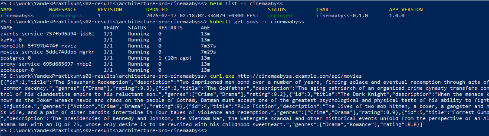

—Â‚ËÒ ÛÊ ·˚Î ÓÔËÒ‡Ì ‚ 
## –ò–∑—É—á–∏—Ç–µ [README.md](README.md) —Ñ–∞–π–ª –∏ —Å—Ç—Ä—É–∫—Ç—É—Ä—É –ø—Ä–æ–µ–∫—Ç–∞.

## –ó–∞–¥–∞–Ω–∏–µ 1

1. –°–ø—Ä–æ–µ–∫—Ç–∏—Ä—É–π—Ç–µ to be –∞—Ä—Ö–∏—Ç–µ–∫—Ç—É—Ä—É –ö–∏–Ω–æ–ë–µ–∑–¥–Ω—ã, —Ä–∞–∑–¥–µ–ª–∏–≤ –≤—Å—é —Å–∏—Å—Ç–µ–º—É –Ω–∞ –æ—Ç–¥–µ–ª—å–Ω—ã–µ
 –¥–æ–º–µ–Ω—ã –∏ –æ—Ä–≥–∞–Ω–∏–∑–æ–≤–∞–≤ –∏–Ω—Ç–µ–≥—Ä–∞—Ü–∏–æ–Ω–Ω–æ–µ –≤–∑–∞–∏–º–æ–¥–µ–π—Å—Ç–≤–∏–µ –∏ –µ–¥–∏–Ω—É—é —Ç–æ—á–∫—É –≤—ã–∑–æ–≤–∞ —Å–µ—Ä–≤–∏—Å–æ–≤.
–†–µ–∑—É–ª—å—Ç–∞—Ç –ø—Ä–µ–¥—Å—Ç–∞–≤—å—Ç–µ –≤ –≤–∏–¥–µ –∫–æ–Ω—Ç–µ–π–Ω–µ—Ä–Ω–æ–π –¥–∏–∞–≥—Ä–∞–º–º—ã –≤ –Ω–æ—Ç–∞—Ü–∏–∏ –°4.
–î–æ–±–∞–≤—å—Ç–µ —Å—Å—ã–ª–∫—É –Ω–∞ —Ñ–∞–π–ª –≤ —ç—Ç–æ—Ç —à–∞–±–ª–æ–Ω


–î–∏–∞–≥—Ä–∞–º–º–∞ –∫–æ–Ω—Ç–µ–π–Ω–µ—Ä–æ–≤ –≤ –Ω–æ—Ç–∞—Ü–∏–∏ –°4 (PlantUML): **[docs/schemas/containers.puml](docs/schemas/containers.puml)**,


–û–ø–∏—Å–∞–Ω–∏–µ: [docs/to-be-architecture.md](docs/to-be-architecture.md)

**–†–µ—à–µ–Ω–∏–µ.**
–°–∏—Å—Ç–µ–º–∞ —Ä–∞–∑–¥–µ–ª–µ–Ω–∞ –Ω–∞ –¥–æ–º–µ–Ω—ã:
- Movies (–≤—ã–Ω–µ—Å–µ–Ω –≤ movies-service)
- Events (–Ω–æ–≤—ã–π events-service –Ω–∞ Kafka)
- Users/Payments/Subscriptions (–ø–æ–∫–∞ –≤ –º–æ–Ω–æ–ª–∏—Ç–µ, —Å–ª–µ–¥—É—é—â–∏–µ –∫–∞–Ω–¥–∏–¥–∞—Ç—ã –Ω–∞ –≤—ã–¥–µ–ª–µ–Ω–∏–µ).
- Единая точка вызова — API Gateway (proxy-service, паттерн Strangler Fig):
  –≤–µ—Å—å –∫–ª–∏–µ–Ω—Ç—Å–∫–∏–π —Ç—Ä–∞—Ñ–∏–∫ –∏–¥–µ—Ç —á–µ—Ä–µ–∑ Ingress -> proxy-service, –∫–æ—Ç–æ—Ä—ã–π –ø–æ—Å—Ç–µ–ø–µ–Ω–Ω–æ
  –ø–µ—Ä–µ–∫–ª—é—á–∞–µ—Ç —Ç—Ä–∞—Ñ–∏–∫ —Å –º–æ–Ω–æ–ª–∏—Ç–∞ –Ω–∞ –º–∏–∫—Ä–æ—Å–µ—Ä–≤–∏—Å—ã –ø–æ —Ñ–∏—á–µ-—Ñ–ª–∞–≥—É `GRADUAL_MIGRATION`
  и проценту `MOVIES_MIGRATION_PERCENT`. Асинхронное интеграционное взаимодействие — через
  Kafka (—Ç–æ–ø–∏–∫–∏ `movie-events`, `user-events`, `payment-events`).

## –ó–∞–¥–∞–Ω–∏–µ 2

### 1. Proxy
–ö–æ–º–∞–Ω–¥–∞ –ö–∏–Ω–æ–ë–µ–∑–¥–Ω—ã —É–∂–µ –≤—ã–¥–µ–ª–∏–ª–∞ —Å–µ—Ä–≤–∏—Å –º–µ—Ç–∞–¥–∞–Ω–Ω—ã—Ö –æ —Ñ–∏–ª—å–º–∞—Ö movies
 –∏ –≤–∞–º –Ω–µ–æ–±—Ö–æ–¥–∏–º–æ —Ä–µ–∞–ª–∏–∑–æ–≤–∞—Ç—å –±–µ—Å—à–æ–≤–Ω—ã–π –ø–µ—Ä–µ—Ö–æ–¥ —Å –ø—Ä–∏–º–µ–Ω–µ–Ω–∏–µ–º
 –ø–∞—Ç—Ç–µ—Ä–Ω–∞ Strangler Fig –≤ —á–∞—Å—Ç–∏ —Ä–µ–∞–ª–∏–∑–∞—Ü–∏–∏ –ø—Ä–æ–∫—Å–∏-—Å–µ—Ä–≤–∏—Å–∞ (API Gateway),
 —Å –ø–æ–º–æ—â—å—é –∫–æ—Ç–æ—Ä–æ–≥–æ –º–æ–∂–Ω–æ –±—É–¥–µ—Ç –ø–æ—Å—Ç–µ–ø–µ–Ω–Ω–æ –ø–µ—Ä–µ–∫–ª—é—á–∞—Ç—å —Ç—Ä–∞—Ñ—Ñ–∏–∫,
 –∏—Å–ø–æ–ª—å–∑—É—è —Ñ–∏—á–µ-—Ñ–ª–∞–≥.


–†–µ–∞–ª–∏–∑—É–π—Ç–µ —Å–µ—Ä–≤–∏—Å –Ω–∞ –ª—é–±–æ–º —è–∑—ã–∫–µ –ø—Ä–æ–≥—Ä–∞–º–º–∏—Ä–æ–≤–∞–Ω–∏—è –≤ ./src/microservices/proxy.

–ö–æ–Ω—Ñ–∏–≥—É—Ä–∞—Ü–∏—è –¥–ª—è –∑–∞–ø—É—Å–∫–∞ —Å–µ—Ä–≤–∏—Å–∞ —á–µ—Ä–µ–∑ docker-compose —É–∂–µ –¥–æ–±–∞–≤–ª–µ–Ω–∞
```yaml
  proxy-service:
    build:
      context: ./src/microservices/proxy
      dockerfile: Dockerfile
    container_name: cinemaabyss-proxy-service
    depends_on:
      - monolith
      - movies-service
      - events-service
    ports:
      - "8000:8000"
    environment:
      PORT: 8000
      MONOLITH_URL: http://monolith:8080
      #–º–æ–Ω–æ–ª–∏—Ç
      MOVIES_SERVICE_URL: http://movies-service:8081 #—Å–µ—Ä–≤–∏—Å movies
      EVENTS_SERVICE_URL: http://events-service:8082 
      GRADUAL_MIGRATION: "true" # –≤–∫–ª/–≤—ã–∫–ª –ø—Ä–æ—Å—Ç–æ–≥–æ —Ñ–∏—á–µ-—Ñ–ª–∞–≥–∞
      MOVIES_MIGRATION_PERCENT: "50" # –ø—Ä–æ—Ü–µ–Ω—Ç –º–∏–≥—Ä–∞—Ü–∏–∏
    networks:
      - cinemaabyss-network
```

- –ü–æ—Å–ª–µ —Ä–µ–∞–ª–∏–∑–∞—Ü–∏–∏ –∑–∞–ø—É—Å—Ç–∏—Ç–µ postman —Ç–µ—Å—Ç—ã - –æ–Ω–∏ –≤—Å–µ –¥–æ–ª–∂–Ω—ã –±—ã—Ç—å –∑–µ–ª–µ–Ω—ã–µ.
- –û—Ç–ø—Ä–∞–≤—å—Ç–µ –∑–∞–ø—Ä–æ—Å—ã –∫ API Gateway:
   ```bash
   curl http://localhost:8000/api/movies
   ```
- –ü—Ä–æ—Ç–µ—Å—Ç–∏—Ä—É–π—Ç–µ –ø–æ—Å—Ç–µ–ø–µ–Ω–Ω—ã–π –ø–µ—Ä–µ—Ö–æ–¥, –∏–∑–º–µ–Ω–∏–≤ –ø–µ—Ä–µ–º–µ–Ω–Ω—É—é –æ–∫—Ä—É–∂–µ–Ω–∏—è
 MOVIES_MIGRATION_PERCENT –≤ —Ñ–∞–π–ª–µ docker-compose.yml.

**–†–µ—à–µ–Ω–∏–µ.**
 –ü—Ä–æ–∫—Å–∏-—Å–µ—Ä–≤–∏—Å —Ä–µ–∞–ª–∏–∑–æ–≤–∞–Ω –Ω–∞ Python (Flask + requests)
 –≤ [src/microservices/proxy/app.py](src/microservices/proxy/app.py):

- `/health` — health-check прокси (200, `Strangler Fig Proxy is healthy`);
- `/api/movies*` — при `GRADUAL_MIGRATION=true` случайные `MOVIES_MIGRATION_PERCENT`% запросов
  уходят в movies-service, остальные — в монолит; при выключенном флаге весь трафик movies
  –∏–¥–µ—Ç –≤ –º–∏–∫—Ä–æ—Å–µ—Ä–≤–∏—Å; `/api/movies/health` –≤—Å–µ–≥–¥–∞ –º–∞—Ä—à—Ä—É—Ç–∏–∑–∏—Ä—É–µ—Ç—Å—è –≤ movies-service;
- `/api/events*` — проксируется в events-service;
- все остальные пути (`/api/users`, `/api/payments`, `/api/subscriptions`, …) — в монолит.

–ü—Ä–æ–∫—Å–∏ –ø–µ—Ä–µ—Å—ã–ª–∞–µ—Ç –º–µ—Ç–æ–¥, query-–ø–∞—Ä–∞–º–µ—Ç—Ä—ã,
 —Ç–µ–ª–æ –∏ –∑–∞–≥–æ–ª–æ–≤–∫–∏ (–∫—Ä–æ–º–µ hop-by-hop),
 –ø—Ä–∏ –Ω–µ–¥–æ—Å—Ç—É–ø–Ω–æ—Å—Ç–∏ –±—ç–∫–µ–Ω–¥–∞ –≤–æ–∑–≤—Ä–∞—â–∞–µ—Ç 502.

 –†–µ–∑—É–ª—å—Ç–∞—Ç—ã –ø—Ä–æ–≤–µ—Ä–∫–∏:

- postman-—Ç–µ—Å—Ç—ã: **22 –∑–∞–ø—Ä–æ—Å–∞, 42 assertions, 0 –æ—à–∏–±–æ–∫** (–≤—Å–µ –∑–µ–ª–µ–Ω—ã–µ, –≤–∫–ª—é—á–∞—è events)
— лог прогона: [docs/postman-local-tests.txt](docs/postman-local-tests.txt)

- `curl http://localhost:8000/api/movies` –≤–æ–∑–≤—Ä–∞—â–∞–µ—Ç —Å–ø–∏—Å–æ–∫ —Ñ–∏–ª—å–º–æ–≤;
- –ø—Ä–∏ `MOVIES_MIGRATION_PERCENT=50` —Ñ–∞–∫—Ç–∏—á–µ—Å–∫–æ–µ —Ä–∞—Å–ø—Ä–µ–¥–µ–ª–µ–Ω–∏–µ 20+ –∑–∞–ø—Ä–æ—Å–æ–≤
  –ø–æ –ª–æ–≥–∞–º –ø—Ä–æ–∫—Å–∏: ~50/50 –º–µ–∂–¥—É monolith –∏ movies-service
  (–ø—Ä–æ–≤–µ—Ä–µ–Ω–æ –ø–æ–¥—Å—á–µ—Ç–æ–º —Å—Ç—Ä–æ–∫ `GET /api/movies -> <backend>` –≤ –ª–æ–≥–µ),
  при `100` — весь трафик в movies-service.

### 2. Kafka
 –í–∞–º –∫–∞–∫ –∞—Ä—Ö–∏—Ç–µ–∫—Ç—É—Ä—É –Ω—É–∂–Ω–æ —Ç–∞–∫–∂–µ –ø—Ä–æ–≤–µ—Ä–∏—Ç—å –≥–∏–ø–æ—Ç–µ–∑—É –Ω–∞—Å–∫–æ–ª—å–∫–æ
 –ø—Ä–æ—Å—Ç–æ —Ä–µ–∞–ª–∏–∑–æ–≤–∞—Ç—å –ø—Ä–∏–º–µ–Ω–µ–Ω–∏–µ Kafka –≤ –¥–∞–Ω–Ω–æ–π –∞—Ä—Ö–∏—Ç–µ–∫—Ç—É—Ä–µ.

–î–ª—è —ç—Ç–æ–≥–æ –Ω—É–∂–Ω–æ —Å–¥–µ–ª–∞—Ç—å MVP —Å–µ—Ä–≤–∏—Å events, –∫–æ—Ç–æ—Ä—ã–π –±—É–¥–µ—Ç –ø—Ä–∏ –≤—ã–∑–æ–≤–µ API —Å–æ–∑–¥–∞–≤–∞—Ç—å
 –∏ —Å–∞–º –∂–µ —á–∏—Ç–∞—Ç—å —Å–æ–æ–±—â–µ–Ω–∏—è –≤ —Ç–æ–ø–∏–∫–µ Kafka.

    - –†–∞–∑—Ä–∞–±–æ—Ç–∞–π—Ç–µ —Å–µ—Ä–≤–∏—Å –Ω–∞ –ª—é–±–æ–º —è–∑—ã–∫–µ –ø—Ä–æ–≥—Ä–∞–º–º–∏—Ä–æ–≤–∞–Ω–∏—è —Å consumer'–∞–º–∏ –∏ producer'–∞–º–∏.
    - –†–µ–∞–ª–∏–∑—É–π—Ç–µ –ø—Ä–æ—Å—Ç–æ–π API, –ø—Ä–∏ –≤—ã–∑–æ–≤–µ –∫–æ—Ç–æ—Ä–æ–≥–æ –±—É–¥—É—Ç —Å–æ–∑–¥–∞–≤–∞—Ç—å—Å—è —Å–æ–±—ã—Ç–∏—è User/Payment/Movie –∏ –æ–±—Ä–∞–±–∞—Ç—ã–≤–∞—Ç—å—Å—è –≤–Ω—É—Ç—Ä–∏ —Å–µ—Ä–≤–∏—Å–∞ —Å –∑–∞–ø–∏—Å—å—é –≤ –ª–æ–≥
    - –î–æ–±–∞–≤—å—Ç–µ –≤ docker-compose –Ω–æ–≤—ã–π —Å–µ—Ä–≤–∏—Å, kafka —Ç–∞–º —É–∂–µ –µ—Å—Ç—å

–ù–µ–æ–±—Ö–æ–¥–∏–º—ã–µ —Ç–µ—Å—Ç—ã –¥–ª—è –ø—Ä–æ–≤–µ—Ä–∫–∏ —ç—Ç–æ–≥–æ API –≤—ã–∑—ã–≤–∞—é—Ç—Å—è –ø—Ä–∏ –∑–∞–ø—É—Å–∫–µ npm run test:local –∏–∑ –ø–∞–ø–∫–∏ tests/postman 

!!! –ü—Ä–∏–ª–æ–∂–∏—Ç–µ —Å–∫—Ä–∏–Ω—à–æ—Ç —Ç–µ—Å—Ç–æ–≤ –∏ —Å–∫—Ä–∏–Ω—à–æ—Ç —Å–æ—Å—Ç–æ—è–Ω–∏—è —Ç–æ–ø–∏–∫–æ–≤ Kafka http://localhost:8090 

**–†–µ—à–µ–Ω–∏–µ.**
 Events-—Å–µ—Ä–≤–∏—Å —Ä–µ–∞–ª–∏–∑–æ–≤–∞–Ω –Ω–∞ Python (Flask + kafka-python)
 –≤ [src/microservices/events/app.py](src/microservices/events/app.py):

- producer: `POST /api/events/movie|user|payment` –≤–∞–ª–∏–¥–∏—Ä—É–µ—Ç –æ–±—è–∑–∞—Ç–µ–ª—å–Ω—ã–µ –ø–æ–ª—è,
  —Ñ–æ—Ä–º–∏—Ä—É–µ—Ç —Å–æ–±—ã—Ç–∏–µ `{id, type, timestamp, payload}` –∏
  –ø—É–±–ª–∏–∫—É–µ—Ç –µ–≥–æ –≤ —Å–æ–æ—Ç–≤–µ—Ç—Å—Ç–≤—É—é—â–∏–π —Ç–æ–ø–∏–∫ (`movie-events`, `user-events`, `payment-events`),
  –≤ –æ—Ç–≤–µ—Ç –≤–æ–∑–≤—Ä–∞—â–∞–µ—Ç 201 —Å `{status: "success", partition, offset, event}`
  —Å–æ–≥–ª–∞—Å–Ω–æ api-specification.yaml
- consumer: —Ñ–æ–Ω–æ–≤—ã–π –ø–æ—Ç–æ–∫ —Å consumer-group `events-service` —á–∏—Ç–∞–µ—Ç –≤—Å–µ —Ç—Ä–∏ —Ç–æ–ø–∏–∫–∞
 –∏ –ø–∏—à–µ—Ç –æ–±—Ä–∞–±–æ—Ç–∫—É –∫–∞–∂–¥–æ–≥–æ —Å–æ–±—ã—Ç–∏—è –≤ –ª–æ–≥ —Å–µ—Ä–≤–∏—Å–∞ (`Processed event from topic=... partition=... offset=...`)
- `GET /api/events/health` –≤–æ–∑–≤—Ä–∞—â–∞–µ—Ç `{"status": true}`

–°–µ—Ä–≤–∏—Å –≤ docker-compose.yml
 (events-service, –ø–æ—Ä—Ç 8082, `KAFKA_BROKERS=kafka:9092`).
 –ü—Ä–æ–≤–µ—Ä–µ–Ω–æ: —Å–æ–±—ã—Ç–∏–µ –ø—É–±–ª–∏–∫—É–µ—Ç—Å—è (partition=0, offset —Ä–∞—Å—Ç–µ—Ç),
 consumer –µ–≥–æ –æ–±—Ä–∞–±–∞—Ç—ã–≤–∞–µ—Ç –∏ –ª–æ–≥–∏—Ä—É–µ—Ç.
 –í—Å–µ postman-—Ç–µ—Å—Ç—ã Events Microservice –∑–µ–ª–µ–Ω—ã–µ.

–°–∫—Ä–∏–Ω—à–æ—Ç—ã (—Ç–µ—Å—Ç—ã –∏ —Ç–æ–ø–∏–∫–∏ Kafka –∏–∑ UI http://localhost:8090):


## –ó–∞–¥–∞–Ω–∏–µ 3

–ö–æ–º–∞–Ω–¥–∞ –Ω–∞—á–∞–ª–∞ –ø–µ—Ä–µ–µ–∑–¥ –≤ Kubernetes –¥–ª—è –ª—É—á—à–µ–≥–æ –º–∞—Å—à—Ç–∞–±–∏—Ä–æ–≤–∞–Ω–∏—è –∏ –ø–æ–≤—ã—à–µ–Ω–∏—è –Ω–∞–¥–µ–∂–Ω–æ—Å—Ç–∏. 
–í–∞–º, –∫–∞–∫ –∞—Ä—Ö–∏—Ç–µ–∫—Ç–æ—Ä—É –æ—Å—Ç–∞–ª–æ—Å—å —Å–∞–º–æ–µ —Å–ª–æ–∂–Ω–æ–µ:
 - —Ä–µ–∞–ª–∏–∑–æ–≤–∞—Ç—å CI/CD –¥–ª—è —Å–±–æ—Ä–∫–∏ –ø—Ä–æ–∫—Å–∏ —Å–µ—Ä–≤–∏—Å–∞
 - —Ä–µ–∞–ª–∏–∑–æ–≤–∞—Ç—å –Ω–µ–æ–±—Ö–æ–¥–∏–º—ã–µ –∫–æ–Ω—Ñ–∏–≥—É—Ä–∞—Ü–∏–æ–Ω–Ω—ã–µ —Ñ–∞–π–ª—ã –¥–ª—è –ø–µ—Ä–µ–∫–ª—é—á–µ–Ω–∏—è —Ç—Ä–∞—Ñ–∏–∫–∞.


### CI/CD

 –í –ø–∞–ø–∫–µ .github/worflows –¥–æ—Ä–∞–±–æ—Ç–∞–π—Ç–µ –¥–µ–ø–ª–æ–π –Ω–æ–≤—ã—Ö —Å–µ—Ä–≤–∏—Å–æ–≤ proxy
 –∏ events –≤ docker-build-push.yml , —á—Ç–æ–±—ã api-tests –ø—Ä–∏ —Å–±–æ—Ä–∫–µ –æ—Ç—Ä–∞–±–∞—Ç—ã–≤–∞–ª–∏
 –∫–æ—Ä—Ä–µ–∫—Ç–Ω–æ –ø—Ä–∏ –æ—Ç–ø—Ä–∞–≤–∫–µ –∫–æ–º–º–∏—Ç–∞ –≤ –≤–∞—à—É –Ω–æ–≤—É—é –≤–µ—Ç–∫—É.

–ù—É–∂–Ω–æ –¥–æ—Ä–∞–±–æ—Ç–∞—Ç—å 
```yaml
on:
  push:
    branches: [ main ]
    paths:
      - 'src/**'
      - '.github/workflows/docker-build-push.yml'
  release:
    types: [published]
```
–∏ –¥–æ–±–∞–≤–∏—Ç—å –Ω–µ–æ–±—Ö–æ–¥–∏–º—ã–µ —à–∞–≥–∏ –≤ –±–ª–æ–∫

```yaml
jobs:
  build-and-push:
    runs-on: ubuntu-latest
    permissions:
      contents: read
      packages: write

    steps:
      - name: Checkout repository
        uses: actions/checkout@v3

      - name: Set up Docker Buildx
        uses: docker/setup-buildx-action@v2

      - name: Log in to the Container registry
        uses: docker/login-action@v2
        with:
          registry: ${{ env.REGISTRY }}
          username: ${{ github.actor }}
          password: ${{ secrets.GITHUB_TOKEN }}

```

–ö–∞–∫ —Ç–æ–ª—å–∫–æ —Å–±–æ—Ä–∫–∞ –æ—Ç—Ä–∞–±–æ—Ç–∞–µ—Ç –∏ –≤ github registry –ø–æ—è–≤—è—Ç—Å—è
 –≤–∞—à–∏ –æ–±—Ä–∞–∑—ã, –º–æ–∂–Ω–æ –ø–µ—Ä–µ—Ö–æ–¥–∏—Ç—å –∫ –±–ª–æ–∫—É –Ω–∞—Å—Ç—Ä–æ–π–∫–∏ Kubernetes
–£—Å–ø–µ—à–Ω—ã–º —Ä–µ–∑—É–ª—å—Ç–∞—Ç–æ–º –¥–∞–Ω–Ω–æ–≥–æ —à–∞–≥–∞ —è–≤–ª—è–µ—Ç—Å—è "–∑–µ–ª–µ–Ω–∞—è" —Å–±–æ—Ä–∫–∞ –∏ "–∑–µ–ª–µ–Ω—ã–µ" —Ç–µ—Å—Ç—ã

**–†–µ—à–µ–Ω–∏–µ.**

 –í [.github/workflows/docker-build-push.yml](.github/workflows/docker-build-push.yml):

- триггер `push.branches` расширен до `[ main, cinema ]` — сборка запускается при коммите в ветку задания;
- добавлены шаги `Extract metadata` + `Build and push` для **events-service** (context `./src/microservices/events`) и **proxy-service** (context `./src/microservices/proxy`) по аналогии с monolith/movies — образы публикуются в `ghcr.io/<owner>/<repo>/events-service` и `.../proxy-service` с тегами `latest`, `sha`, имя ветки;
- в [.github/workflows/api-tests.yml](.github/workflows/api-tests.yml) триггер расширен до `[ main, master, cinema ]`; workflow поднимает весь стек через docker compose и прогоняет newman-тесты в контейнере — локальный прогон этого же сценария зеленый (22/22 запросов, 42/42 assertions).


### Proxy –≤ Kubernetes

#### –®–∞–≥ 1
–î–ª—è –¥–µ–ø–ª–æ—è –≤ kubernetes –Ω–µ–æ–±—Ö–æ–¥–∏–º–æ –∑–∞–ª–æ–≥–∏–Ω–∏—Ç—å—Å—è –≤ docker registry Github'–∞.
1. –°–æ–∑–¥–∞–π—Ç–µ Personal Access Token (PAT) https://github.com/settings/tokens . –°–æ–∑–¥–∞–≤–∞–π—Ç–µ class —Å –ø—Ä–∞–≤–æ–º read:packages
2. –í src/kubernetes/*.yaml (event-service, monolith, movies-service –∏ proxy-service)  –æ—Ç—Ä–µ–¥–∞–∫—Ç–∏—Ä—É–π—Ç–µ –ø—É—Ç—å –¥–æ –≤–∞—à–∏—Ö –æ–±—Ä–∞–∑–æ–≤ 

```bash
 spec:
      containers:
      - name: events-service
        image: ghcr.io/–≤–∞—à –ª–æ–≥–∏–Ω/–∏–º—è —Ä–µ–ø–æ–∑–∏—Ç–æ—Ä–∏—è/events-service:latest
```

3. –î–æ–±–∞–≤—å—Ç–µ –≤ —Å–µ–∫—Ä–µ—Ç src/kubernetes/dockerconfigsecret.yaml –≤ –ø–æ–ª–µ
```bash
 .dockerconfigjson: –∑–Ω–∞—á–µ–Ω–∏–µ –≤ base64 —Ñ–∞–π–ª–∞ ~/.docker/config.json         	
```

4. –ï—Å–ª–∏ –≤ ~/.docker/config.json –Ω–µ—Ç –∑–Ω–∞—á–µ–Ω–∏—è –¥–ª—è –∞—É—Ç–µ–Ω—Ç–∏—Ñ–∏–∫–∞—Ü–∏–∏
```json
{
        "auths": {
                "ghcr.io": {
                       —Ç—É—Ç –ø—É—Å—Ç–æ
                }
        }
}
```
—Ç–æ –≤—ã–ø–æ–ª–Ω–∏—Ç–µ 

–∏ –¥–æ–±–∞–≤—å—Ç–µ

```json 
 "auth": "–∏–º—è –ø–æ–ª—å–∑–æ–≤–∞—Ç–µ–ª—è:—Ç–æ–∫–µ–Ω –≤ base64"
```

–ß—Ç–æ–±—ã –ø–æ–ª—É—á–∏—Ç—å –∑–Ω–∞—á–µ–Ω–∏–µ –≤ base64 –º–æ–∂–Ω–æ –≤—ã–ø–æ–ª–Ω–∏—Ç—å –∫–æ–º–∞–Ω–¥—É
```bash
 echo -n –≤–∞—à_–ª–æ–≥–∏–Ω:–≤–∞—à_—Ç–æ–∫–µ–Ω | base64
```

–ü–æ—Å–ª–µ –∑–∞–ø–æ–ª–Ω–µ–Ω–∏—è config.json, —Ç–∞–∫–∂–µ –ø—Ä–æ–≥–æ–Ω–∏—Ç–µ —Å–æ–¥–µ—Ä–∂–∏–º–æ–µ —á–µ—Ä–µ–∑ base64

```bash
cat .docker/config.json | base64
```

–∏ –ø–æ–ª—É—á–µ–Ω–Ω–æ–µ –∑–Ω–∞—á–µ–Ω–∏–µ –¥–æ–±–∞–≤–ª—è–µ–º –≤

```bash
 .dockerconfigjson: –∑–Ω–∞—á–µ–Ω–∏–µ –≤ base64 —Ñ–∞–π–ª–∞ ~/.docker/config.json
```

#### –®–∞–≥ 2

  –î–æ—Ä–∞–±–æ—Ç–∞–π—Ç–µ src/kubernetes/event-service.yaml –∏ src/kubernetes/proxy-service.yaml

  - –ù–µ–æ–±—Ö–æ–¥–∏–º–æ —Å–æ–∑–¥–∞—Ç—å Deployment –∏ Service 
  - –î–æ—Ä–∞–±–æ—Ç–∞–π—Ç–µ ingress.yaml, —á—Ç–æ–±—ã –º–æ–∂–Ω–æ –±—ã–ª–æ —Å –ø–æ–º–æ—â—å—é —Ç–µ—Å—Ç–æ–≤ –ø—Ä–æ–≤–µ—Ä–∏—Ç—å —Å–æ–∑–¥–∞–Ω–∏–µ —Å–æ–±—ã—Ç–∏–π
  - –í—ã–ø–æ–ª–Ω–∏—Ç–µ –¥–∞–ª—å—à–µ–π—à–∏–µ —à–∞–≥–∏ –¥–ª—è –ø–æ–¥–Ω—è—Ç–∏—è –∫–ª–∞—Å—Ç–µ—Ä–∞:

  1. –°–æ–∑–¥–∞–π—Ç–µ namespace:
  ```bash
  kubectl apply -f src/kubernetes/namespace.yaml
  ```
  2. –°–æ–∑–¥–∞–π—Ç–µ —Å–µ–∫—Ä–µ—Ç—ã –∏ –ø–µ—Ä–µ–º–µ–Ω–Ω—ã–µ
  ```bash
  kubectl apply -f src/kubernetes/configmap.yaml
  kubectl apply -f src/kubernetes/secret.yaml
  kubectl apply -f src/kubernetes/dockerconfigsecret.yaml
  kubectl apply -f src/kubernetes/postgres-init-configmap.yaml
  ```

  3. –†–∞–∑–≤–µ—Ä–Ω–∏—Ç–µ –±–∞–∑—É –¥–∞–Ω–Ω—ã—Ö:
  ```bash
  kubectl apply -f src/kubernetes/postgres.yaml
  ```

  –ù–∞ —ç—Ç–æ–º —ç—Ç–∞–ø–µ –µ—Å–ª–∏ –≤—ã–∑–≤–∞—Ç—å –∫–æ–º–∞–Ω–¥—É
  ```bash
  kubectl -n cinemaabyss get pod
  ```
  –í—ã —É–≤–∏–¥–∏—Ç–µ

  NAME         READY   STATUS    
  postgres-0   1/1     Running   

  4. –†–∞–∑–≤–µ—Ä–Ω–∏—Ç–µ Kafka:
  ```bash
  kubectl apply -f src/kubernetes/kafka/kafka.yaml
  ```

  –ü—Ä–æ–≤–µ—Ä—å—Ç–µ, —Ç–µ–ø–µ—Ä—å –¥–æ–ª–∂–Ω–æ –±—ã—Ç—å –∑–∞–ø—É—â–µ–Ω–æ 3 –ø–æ–¥–∞, –µ—Å–ª–∏ —á—Ç–æ-—Ç–æ –Ω–µ —Ç–∞–∫, —Ç–æ –ø–æ—Å–º–æ—Ç—Ä–∏—Ç–µ –ª–æ–≥–∏

  ```bash
  kubectl -n cinemaabyss logs –∏–º—è_–ø–æ–¥–∞ (–Ω–∞–ø—Ä–∏–º–µ—Ä - kafka-0)
  ```

  5. –†–∞–∑–≤–µ—Ä–Ω–∏—Ç–µ –º–æ–Ω–æ–ª–∏—Ç:

  ```bash
  kubectl apply -f src/kubernetes/monolith.yaml
  ```

  6. –†–∞–∑–≤–µ—Ä–Ω–∏—Ç–µ –º–∏–∫—Ä–æ—Å–µ—Ä–≤–∏—Å—ã:

  ```bash
  kubectl apply -f src/kubernetes/movies-service.yaml
  kubectl apply -f src/kubernetes/events-service.yaml
  ```

  7. –†–∞–∑–≤–µ—Ä–Ω–∏—Ç–µ –ø—Ä–æ–∫—Å–∏-—Å–µ—Ä–≤–∏—Å:
  ```bash
  kubectl apply -f src/kubernetes/proxy-service.yaml
  ```

  –ü–æ—Å–ª–µ –∑–∞–ø—É—Å–∫–∞ –∏ –ø–æ–¥–Ω—è—Ç–∏—è –ø–æ–¥–æ–≤ –≤—ã–≤–æ–¥ –∫–æ–º–∞–Ω–¥—ã 

  ```bash
  kubectl -n cinemaabyss get pod
  ```

  –ë—É–¥–µ—Ç –Ω–∞–ø–æ–¥–æ–±–∏–µ —Ç–∞–∫–æ–≥–æ

  NAME                              READY   STATUS    

  events-service-7587c6dfd5-6whzx   1/1     Running  

  kafka-0                           1/1     Running   

  monolith-8476598495-wmtmw         1/1     Running  

  movies-service-6d5697c584-4qfqs   1/1     Running  

  postgres-0                        1/1     Running  

  proxy-service-577d6c549b-6qfcv    1/1     Running  

  zookeeper-0                       1/1     Running 

  8. –î–æ–±–∞–≤–∏–º ingress

  - –¥–æ–±–∞–≤—å—Ç–µ –∞–¥–¥–æ–Ω
  ```bash
  minikube addons enable ingress
  ```
  ```bash
  kubectl apply -f src/kubernetes/ingress.yaml
  ```
  9. –î–æ–±–∞–≤—å—Ç–µ –≤ /etc/hosts
  127.0.0.1 cinemaabyss.example.com

  10. –í—ã–∑–æ–≤–∏—Ç–µ
  ```bash
  minikube tunnel
  ```
  11. –í—ã–∑–æ–≤–∏—Ç–µ https://cinemaabyss.example.com/api/movies
  –í—ã –¥–æ–ª–∂–Ω—ã —É–≤–∏–¥–µ—Ç—å –≤—ã–≤–æ–¥ —Å–ø–∏—Å–∫–∞ —Ñ–∏–ª—å–º–æ–≤
  –ú–æ–∂–Ω–æ –ø–æ—ç–∫—Å–ø–µ—Ä–∏–º–µ–Ω—Ç–∏—Ä–æ–≤–∞—Ç—å —Å–æ –∑–Ω–∞—á–µ–Ω–∏–µ–º   MOVIES_MIGRATION_PERCENT –≤ src/kubernetes/configmap.yaml –∏ —É–±–µ–¥–∏—Ç—Å—è, —á—Ç–æ –≤—ã–∑–æ–≤—ã movies —É—Ö–æ–¥—è—Ç –ø–æ–ª–Ω–æ—Å—Ç—å—é –≤ –Ω–æ–≤—ã–π —Å–µ—Ä–≤–∏—Å

  12. –ó–∞–ø—É—Å—Ç–∏—Ç–µ —Ç–µ—Å—Ç—ã –∏–∑ –ø–∞–ø–∫–∏ tests/postman
  ```bash
   npm run test:kubernetes
  ```
  –ß–∞—Å—Ç—å —Ç–µ—Å—Ç–æ–≤ —Å health-—á–µ–∫ —É–ø–∞–¥–µ—Ç, –Ω–æ —Å–æ–∑–¥–∞–Ω–∏–µ —Å–æ–±—ã—Ç–∏–π –æ—Ç—Ä–∞–±–æ—Ç–∞–µ—Ç.
  –û—Ç–∫—Ä–æ–π—Ç–µ –ª–æ–≥–∏ event-service –∏ —Å–¥–µ–ª–∞–π—Ç–µ —Å–∫—Ä–∏–Ω—à–æ—Ç –æ–±—Ä–∞–±–æ—Ç–∫–∏ —Å–æ–±—ã—Ç–∏–π

**–†–µ—à–µ–Ω–∏–µ (–®–∞–≥ 2).** –î–æ—Ä–∞–±–æ—Ç–∞–Ω—ã –º–∞–Ω–∏—Ñ–µ—Å—Ç—ã:

- [src/kubernetes/proxy-service.yaml](src/kubernetes/proxy-service.yaml) — Deployment (образ `proxy-service:latest`, порт 8000, env из `cinemaabyss-config` + `EVENTS_SERVICE_URL`, probes на `/health`, `imagePullSecrets: dockerconfigjson`) и Service (ClusterIP 8000);
- [src/kubernetes/events-service.yaml](src/kubernetes/events-service.yaml) — Deployment (образ `events-service:latest`, порт 8082, `KAFKA_BROKERS=kafka:9092`, probes на `/api/events/health`) и Service (ClusterIP 8082);
- [src/kubernetes/ingress.yaml](src/kubernetes/ingress.yaml) — добавлен маршрут `/` -> `proxy-service:8000` (единая точка входа, все запросы включая `/api/movies` идут через прокси); маршрут `/api/events` -> `events-service:8082` оставлен для прямой проверки создания событий тестами;
- [src/kubernetes/configmap.yaml](src/kubernetes/configmap.yaml) — добавлены `EVENTS_SERVICE_URL` и `KAFKA_BROKERS`.

–ó–∞–º–µ–Ω–∏–ª –ø—É—Ç—å –∫ –æ–±—Ä–∞–∑–∞–º –Ω–∞ `ghcr.io/agr3332211/architecture-pro-cinemaabyss/*` –Ω–∞ –ø—É—Ç—å —Å–≤–æ–µ–≥–æ —Ä–µ–ø–æ–∑–∏—Ç–æ—Ä–∏—è
`dockerconfigsecret.yaml` - –≤—Å—Ç–∞–≤–∏–ª PAT –∏ –¥–æ–±–∞–≤–∏–ª –≤ .gitignore 
- `src/kubernetes/dockerconfigsecret.yaml`
- `src/kubernetes/helm/values.yaml`


 Дальше по шагам 1–12:
 namespace > configmap/secrets > postgres > kafka > monolith > –º–∏–∫—Ä–æ—Å–µ—Ä–≤–∏—Å—ã > proxy > ingress > minikube tunnel.

NB! –í–º–µ—Å—Ç–æ 8:
```
kubectl get ingressclass
```


#### –®–∞–≥ 3
–î–æ–±–∞–≤—å—Ç–µ —Å—é–¥–∞ —Å–∫—Ä–∏–Ω—à–æ—Ç–∞ –≤—ã–≤–æ–¥–∞ –ø—Ä–∏ –≤—ã–∑–æ–≤–µ https://cinemaabyss.example.com/api/movies –∏  —Å–∫—Ä–∏–Ω—à–æ—Ç –≤—ã–≤–æ–¥–∞ event-service –ø–æ—Å–ª–µ –≤—ã–∑–æ–≤–∞ —Ç–µ—Å—Ç–æ–≤.


## –ó–∞–¥–∞–Ω–∏–µ 4
–î–ª—è –ø—Ä–æ—Å—Ç–æ—Ç—ã –¥–∞–ª—å–Ω–µ–π—à–µ–≥–æ –æ–±–Ω–æ–≤–ª–µ–Ω–∏—è –∏ —Ä–∞–∑–≤–µ—Ä—Ç—ã–≤–∞–Ω–∏—è –≤–∞–º –∫–∞–∫ –∞—Ä—Ö–∏—Ç–µ–∫—Ç—É—Ä—É
 –Ω–µ–æ–±—Ö–æ–¥–∏–º–æ —Ç–∞–∫ –∂–µ —Ä–µ–∞–ª–∏–∑–æ–≤–∞—Ç—å helm-—á–∞—Ä—Ç—ã –¥–ª—è –ø—Ä–æ–∫—Å–∏-—Å–µ—Ä–≤–∏—Å–∞ –∏ –ø—Ä–æ–≤–µ—Ä–∏—Ç—å —Ä–∞–±–æ—Ç—É 

–î–ª—è —ç—Ç–æ–≥–æ:
1. –ü–µ—Ä–µ–π–¥–∏—Ç–µ –≤ –¥–∏—Ä–µ–∫—Ç–æ—Ä–∏—é helm –∏ –æ—Ç—Ä–µ–¥–∞–∫—Ç–∏—Ä—É–π—Ç–µ —Ñ–∞–π–ª values.yaml

```yaml
# Proxy service configuration
proxyService:
  enabled: true
  image:
    repository: ghcr.io/db-exp/cinemaabysstest/proxy-service
    tag: latest
    pullPolicy: Always
  replicas: 1
  resources:
    limits:
      cpu: 300m
      memory: 256Mi
    requests:
      cpu: 100m
      memory: 128Mi
  service:
    port: 80
    targetPort: 8000
    type: ClusterIP
```

- –í–º–µ—Å—Ç–æ ghcr.io/db-exp/cinemaabysstest/proxy-service –Ω–∞–ø–∏—à–∏—Ç–µ —Å–≤–æ–π –ø—É—Ç—å –¥–æ –æ–±—Ä–∞–∑–∞ –¥–ª—è –≤—Å–µ—Ö —Å–µ—Ä–≤–∏—Å–æ–≤
- –¥–ª—è imagePullSecret –ø—Ä–æ—Å—Ç–∞–≤—å—Ç–µ —Å–≤–æ–µ –∑–Ω–∞—á–µ–Ω–∏–µ (—Å–∫–æ–ø–∏—Ä—É–π—Ç–µ –∏–∑ –∫–æ–Ω—Ñ–∏–≥—É—Ä–∞—Ü–∏–∏ kubernetes)
  ```yaml
  imagePullSecrets:
      dockerconfigjson: ewoJImF1dGhzIjogewoJCSJnaGNyLmlvIjogewoJCQkiYXV0aCI6ICJaR0l0Wlhod09tZG9jRjl2UTJocVZIa3dhMWhKVDIxWmFVZHJOV2hRUW10aFVXbFZSbTVaTjJRMFNYUjRZMWM9IgoJCX0KCX0sCgkiY3JlZHNTdG9yZSI6ICJkZXNrdG9wIiwKCSJjdXJyZW50Q29udGV4dCI6ICJkZXNrdG9wLWxpbnV4IiwKCSJwbHVnaW5zIjogewoJCSIteC1jbGktaGludHMiOiB7CgkJCSJlbmFibGVkIjogInRydWUiCgkJfQoJfSwKCSJmZWF0dXJlcyI6IHsKCQkiaG9va3MiOiAidHJ1ZSIKCX0KfQ==
  ```

2. –í –ø–∞–ø–∫–µ ./templates/services –∑–∞–ø–æ–ª–Ω–∏—Ç–µ —à–∞–±–ª–æ–Ω—ã –¥–ª—è proxy-service.yaml –∏ events-service.yaml (–æ–ø–∏—Ä–∞–π—Ç–µ—Å—å –Ω–∞ —Å–≤–æ—é kubernetes –∫–æ–Ω—Ñ–∏–≥—É—Ä–∞—Ü–∏—é - —Å–º—ã—Å–ª helm'–∞ —Å–¥–µ–ª–∞—Ç—å —à–∞–±–ª–æ–Ω—ã –¥–ª—è –±—ã—Å—Ç—Ä–æ–≥–æ –æ–±–Ω–æ–≤–ª–µ–Ω–∏—è –∏ —É—Å—Ç–∞–Ω–æ–≤–∫–∏)

```yaml
template:
    metadata:
      labels:
        app: proxy-service
    spec:
      containers:
       –¢—É—Ç –≤–∞—à–∞ –∫–æ–Ω—Ñ–∏–≥—É—Ä–∞—Ü–∏—è
```

3. –ü—Ä–æ–≤–µ—Ä—å—Ç–µ —É—Å—Ç–∞–Ω–æ–≤–∫—É
–°–Ω–∞—á–∞–ª–∞ —É–¥–∞–ª–∏–º —É—Å—Ç–∞–Ω–æ–≤–∫—É —Ä—É–∫–∞–º–∏

```bash
kubectl delete all --all -n cinemaabyss
kubectl delete  namespace cinemaabyss
```
–ó–∞–ø—É—Å—Ç–∏—Ç–µ 
```bash
helm install cinemaabyss .\src\kubernetes\helm --namespace cinemaabyss --create-namespace
```
–ï—Å–ª–∏ –≤ –ø—Ä–æ—Ü–µ—Å—Å–µ –±—É–¥–µ—Ç –æ—à–∏–±–∫–∞
```code
[2025-04-08 21:43:38,780] ERROR Fatal error during KafkaServer startup. Prepare to shutdown (kafka.server.KafkaServer)
kafka.common.InconsistentClusterIdException: The Cluster ID OkOjGPrdRimp8nkFohYkCw doesn't match stored clusterId Some(sbkcoiSiQV2h_mQpwy05zQ) in meta.properties. The broker is trying to join the wrong cluster. Configured zookeeper.connect may be wrong.
```

–ü—Ä–æ–≤–µ—Ä—å—Ç–µ —Ä–∞–∑–≤–µ—Ä—Ç—ã–≤–∞–Ω–∏–µ:
```bash
kubectl get pods -n cinemaabyss
minikube tunnel
```

–ü–æ—Ç–æ–º –≤—ã–∑–æ–≤–∏—Ç–µ 
https://cinemaabyss.example.com/api/movies
–∏ –ø—Ä–∏–ª–æ–∂–∏—Ç–µ —Å–∫—Ä–∏–Ω—à–æ—Ç —Ä–∞–∑–≤–µ—Ä—Ç—ã–≤–∞–Ω–∏—è helm –∏ –≤—ã–≤–æ–¥–∞ https://cinemaabyss.example.com/api/movies

**–†–µ—à–µ–Ω–∏–µ.**

 –ó–∞–ø–æ–ª–Ω–µ–Ω—ã Helm-—à–∞–±–ª–æ–Ω—ã –≤ [src/kubernetes/helm/templates/services/](src/kubernetes/helm/templates/services/):

- [proxy-service.yaml](src/kubernetes/helm/templates/services/proxy-service.yaml) — Deployment (образ/теги/pullPolicy, replicas и resources из `values.yaml`, `PORT` из `proxyService.service.targetPort`, envFrom `cinemaabyss-config`, probes `/health`) и Service (`port: 80` -> `targetPort: 8000`);
- [events-service.yaml](src/kubernetes/helm/templates/services/events-service.yaml) — Deployment (аналогично, probes `/api/events/health`, `KAFKA_BROKERS` из configmap) и Service (8082);
- в [templates/configmap.yaml](src/kubernetes/helm/templates/configmap.yaml) исправлен `MOVIES_SERVICE_URL` (`http://movies:...` -> `http://movies-service:...` — сервис называется movies-service) и добавлены `EVENTS_SERVICE_URL`, `KAFKA_BROKERS`.



# –ó–∞–¥–∞–Ω–∏–µ 5
–ö–æ–º–ø–∞–Ω–∏—è –ø–ª–∞–Ω–∏—Ä—É–µ—Ç –∞–∫—Ç–∏–≤–Ω–æ —Ä–∞–∑–≤–∏–≤–∞—Ç—å—Å—è –∏ –¥–ª—è –ø–æ–≤—ã—à–µ–Ω–∏—è –Ω–∞–¥–µ–∂–Ω–æ—Å—Ç–∏, –±–µ–∑–æ–ø–∞—Å–Ω–æ—Å—Ç–∏, —Ä–µ–∞–ª–∏–∑–∞—Ü–∏–∏ —Å–µ—Ç–µ–≤—ã—Ö –ø–∞—Ç—Ç–µ—Ä–Ω–æ–≤ —Ç–∏–ø–∞ Circuit Breaker –∏ –∫–∞–Ω–∞—Ä–µ–µ—á–Ω–æ–≥–æ –¥–µ–ø–ª–æ—è –≤–∞–º –∫–∞–∫ –∞—Ä—Ö–∏—Ç–µ–∫—Ç–æ—Ä—É –Ω–µ–æ–±—Ö–æ–¥–∏–º–æ —Ä–∞–∑–≤–µ—Ä–Ω—É—Ç—å istio –∏ –Ω–∞—Å—Ç—Ä–æ–∏—Ç—å circuit breaker –¥–ª—è monolith –∏ movies —Å–µ—Ä–≤–∏—Å–æ–≤.

```bash

helm repo add istio https://istio-release.storage.googleapis.com/charts
helm repo update

helm install istio-base istio/base -n istio-system --set defaultRevision=default --create-namespace
helm install istio-ingressgateway istio/gateway -n istio-system
helm install istiod istio/istiod -n istio-system --wait

helm install cinemaabyss .\src\kubernetes\helm --namespace cinemaabyss --create-namespace

kubectl label namespace cinemaabyss istio-injection=enabled --overwrite

kubectl get namespace -L istio-injection

kubectl apply -f .\src\kubernetes\circuit-breaker-config.yaml -n cinemaabyss

```

–¢–µ—Å—Ç–∏—Ä–æ–≤–∞–Ω–∏–µ

# fortio
```bash
kubectl apply -f https://raw.githubusercontent.com/istio/istio/release-1.25/samples/httpbin/sample-client/fortio-deploy.yaml -n cinemaabyss
```

# Get the fortio pod name
```bash
FORTIO_POD=$(kubectl get pod -n cinemaabyss | grep fortio | awk '{print $1}')

kubectl exec -n cinemaabyss $FORTIO_POD -c fortio -- fortio load -c 50 -qps 0 -n 500 -loglevel Warning http://movies-service:8081/api/movies
```
–ù–∞–ø—Ä–∏–º–µ—Ä,

```bash
kubectl exec -n cinemaabyss fortio-deploy-b6757cbbb-7c9qg  -c fortio -- fortio load -c 50 -qps 0 -n 500 -loglevel Warning http://movies-service:8081/api/movies
```

–í—ã–≤–æ–¥ –±—É–¥–µ—Ç —Ç–∏–ø–∞ —Ç–∞–∫–æ–≥–æ

```bash
IP addresses distribution:
10.106.113.46:8081: 421
Code 200 : 79 (15.8 %)
Code 500 : 22 (4.4 %)
Code 503 : 399 (79.8 %)
```
–ú–æ–∂–Ω–æ –µ—â–µ –ø—Ä–æ–≤–µ—Ä–∏—Ç—å —Å—Ç–∞—Ç–∏—Å—Ç–∏–∫—É

```bash
kubectl exec -n cinemaabyss fortio-deploy-b6757cbbb-7c9qg -c istio-proxy -- pilot-agent request GET stats | grep movies-service | grep pending
```

–ò —Ç–∞–º —Å–º–æ—Ç—Ä–∏–º 

```bash
cluster.outbound|8081||movies-service.cinemaabyss.svc.cluster.local;.upstream_rq_pending_total: 311 - —Å—Ç–æ–ª—å–∫–æ —Ä–∞–∑ —Å—Ä–∞–±–∞—Ç—ã–≤–∞–ª circuit breaker
You can see 21 for the upstream_rq_pending_overflow value which means 21 calls so far have been flagged for circuit breaking.
```

–ü—Ä–∏–ª–æ–∂–∏—Ç–µ —Å–∫—Ä–∏–Ω—à–æ—Ç —Ä–∞–±–æ—Ç—ã circuit breaker'–∞

**Решение.** Создан [src/kubernetes/circuit-breaker-config.yaml](src/kubernetes/circuit-breaker-config.yaml) — две `DestinationRule` (Istio) для хостов `monolith` и `movies-service`:

- `connectionPool.tcp.maxConnections: 1`, `http.http1MaxPendingRequests: 1`, `maxRequestsPerConnection: 1` — при конкурентной нагрузке (fortio `-c 50`) лишние запросы мгновенно отбрасываются Envoy с кодом 503 — это и есть срабатывание circuit breaker;
- `outlierDetection` (`consecutive5xxErrors: 1`, `interval: 1s`, `baseEjectionTime: 3m`, `maxEjectionPercent: 100`) — инстансы, отвечающие 5xx, временно исключаются из балансировки.

Порядок применения — по командам выше:
 —É—Å—Ç–∞–Ω–æ–≤–∫–∞ Istio (base, ingressgateway, istiod),
 —É—Å—Ç–∞–Ω–æ–≤–∫–∞ —á–∞—Ä—Ç–∞,
 –≤–∫–ª—é—á–µ–Ω–∏–µ sidecar-injection –¥–ª—è namespace (`istio-injection=enabled`, –ø–æ–¥—ã –Ω—É–∂–Ω–æ –ø–µ—Ä–µ—Å–æ–∑–¥–∞—Ç—å –ø–æ—Å–ª–µ –≤–∫–ª—é—á–µ–Ω–∏—è),
 –∑–∞—Ç–µ–º `kubectl apply -f src/kubernetes/circuit-breaker-config.yaml -n cinemaabyss`.
 Проверка — fortio load `-c 50 -qps 0 -n 500`
  –Ω–∞ `http://movies-service:8081/api/movies`: –∑–Ω–∞—á–∏—Ç–µ–ª—å–Ω–∞—è –¥–æ–ª—è –æ—Ç–≤–µ—Ç–æ–≤ 503,
  —Å—á–µ—Ç—á–∏–∫–∏ `upstream_rq_pending_total` / `upstream_rq_pending_overflow`
  –≤ —Å—Ç–∞—Ç–∏—Å—Ç–∏–∫–µ istio-proxy –ø–æ–∫–∞–∑—ã–≤–∞—é—Ç —Å—Ä–∞–±–∞—Ç—ã–≤–∞–Ω–∏—è circuit breaker.

### Fortio —Å—Ç–∞—Ç–∏—Å—Ç–∏–∫–∞

```
kubectl exec -n cinemaabyss fortio-deploy-78b76b5bdd-g9z9c -c fortio -- fortio load -c 50 -qps 0 -n 500 -loglevel Warning http://movies-service:8081/api/movies
```

```
{"ts":1784387909.288252,"level":"info","r":1,"file":"logger.go","line":298,"msg":"Log level is now 3 Warning (was 2 Info)"}
Fortio 1.69.5 running at 0 queries per second, 4->4 procs, for 500 calls: http://movies-service:8081/api/movies
Starting at max qps with 50 thread(s) [gomax 4] for exactly 500 calls (10 per thread + 0)
{"ts":1784387909.346875,"level":"warn","r":133,"file":"http_client.go","line":1151,"msg":"Non ok http code","code":503,"status":"HTTP/1.1 503","thread":3,"run":0}
{"ts":1784387909.347082,"level":"warn","r":131,"file":"http_client.go","line":1151,"msg":"Non ok http code","code":503,"status":"HTTP/1.1 503","thread":1,"run":0}
{"ts":1784387909.347127,"level":"warn","r":134,"file":"http_client.go","line":1151,"msg":"Non ok http code","code":503,"status":"HTTP/1.1 503","thread":4,"run":0}
{"ts":1784387909.347160,"level":"warn","r":135,"file":"http_client.go","line":1151,"msg":"Non ok http code","code":503,"status":"HTTP/1.1 503","thread":5,"run":0}
{"ts":1784387909.347188,"level":"warn","r":139,"file":"http_client.go","line":1151,"msg":"Non ok http code","code":503,"status":"HTTP/1.1 503","thread":9,"run":0}
{"ts":1784387909.347225,"level":"warn","r":143,"file":"http_client.go","line":1151,"msg":"Non ok http code","code":503,"status":"HTTP/1.1 503","thread":13,"run":0}
{"ts":1784387909.348133,"level":"warn","r":141,"file":"http_client.go","line":1151,"msg":"Non ok http code","code":503,"status":"HTTP/1.1 503","thread":11,"run":0}
{"ts":1784387909.348670,"level":"warn","r":137,"file":"http_client.go","line":1151,"msg":"Non ok http code","code":503,"status":"HTTP/1.1 503","thread":7,"run":0}
{"ts":1784387909.348905,"level":"warn","r":132,"file":"http_client.go","line":1151,"msg":"Non ok http code","code":503,"status":"HTTP/1.1 503","thread":2,"run":0}
{"ts":1784387909.349049,"level":"warn","r":140,"file":"http_client.go","line":1151,"msg":"Non ok http code","code":503,"status":"HTTP/1.1 503","thread":10,"run":0}
{"ts":1784387909.348767,"level":"warn","r":179,"file":"http_client.go","line":1151,"msg":"Non ok http code","code":503,"status":"HTTP/1.1 503","thread":49,"run":0}
{"ts":1784387909.349068,"level":"warn","r":142,"file":"http_client.go","line":1151,"msg":"Non ok http code","code":503,"status":"HTTP/1.1 503","thread":12,"run":0}
{"ts":1784387909.404898,"level":"warn","r":146,"file":"http_client.go","line":1151,"msg":"Non ok http code","code":503,"status":"HTTP/1.1 503","thread":16,"run":0}
{"ts":1784387909.404919,"level":"warn","r":144,"file":"http_client.go","line":1151,"msg":"Non ok http code","code":503,"status":"HTTP/1.1 503","thread":14,"run":0}
{"ts":1784387909.419303,"level":"warn","r":145,"file":"http_client.go","line":1151,"msg":"Non ok http code","code":503,"status":"HTTP/1.1 503","thread":15,"run":0}
{"ts":1784387909.420731,"level":"warn","r":148,"file":"http_client.go","line":1151,"msg":"Non ok http code","code":503,"status":"HTTP/1.1 503","thread":18,"run":0}
{"ts":1784387909.421823,"level":"warn","r":150,"file":"http_client.go","line":1151,"msg":"Non ok http code","code":503,"status":"HTTP/1.1 503","thread":20,"run":0}
{"ts":1784387909.422013,"level":"warn","r":147,"file":"http_client.go","line":1151,"msg":"Non ok http code","code":503,"status":"HTTP/1.1 503","thread":17,"run":0}
{"ts":1784387909.422636,"level":"warn","r":136,"file":"http_client.go","line":1151,"msg":"Non ok http code","code":503,"status":"HTTP/1.1 503","thread":6,"run":0}
{"ts":1784387909.423048,"level":"warn","r":149,"file":"http_client.go","line":1151,"msg":"Non ok http code","code":503,"status":"HTTP/1.1 503","thread":19,"run":0}
{"ts":1784387909.423089,"level":"warn","r":152,"file":"http_client.go","line":1151,"msg":"Non ok http code","code":503,"status":"HTTP/1.1 503","thread":22,"run":0}
{"ts":1784387909.424824,"level":"warn","r":151,"file":"http_client.go","line":1151,"msg":"Non ok http code","code":503,"status":"HTTP/1.1 503","thread":21,"run":0}
{"ts":1784387909.425098,"level":"warn","r":153,"file":"http_client.go","line":1151,"msg":"Non ok http code","code":503,"status":"HTTP/1.1 503","thread":23,"run":0}
{"ts":1784387909.426610,"level":"warn","r":155,"file":"http_client.go","line":1151,"msg":"Non ok http code","code":503,"status":"HTTP/1.1 503","thread":25,"run":0}
{"ts":1784387909.427172,"level":"warn","r":162,"file":"http_client.go","line":1151,"msg":"Non ok http code","code":503,"status":"HTTP/1.1 503","thread":32,"run":0}
{"ts":1784387909.428123,"level":"warn","r":158,"file":"http_client.go","line":1151,"msg":"Non ok http code","code":503,"status":"HTTP/1.1 503","thread":28,"run":0}
{"ts":1784387909.428507,"level":"warn","r":156,"file":"http_client.go","line":1151,"msg":"Non ok http code","code":503,"status":"HTTP/1.1 503","thread":26,"run":0}
{"ts":1784387909.437500,"level":"warn","r":176,"file":"http_client.go","line":1151,"msg":"Non ok http code","code":503,"status":"HTTP/1.1 503","thread":46,"run":0}
{"ts":1784387909.428818,"level":"warn","r":138,"file":"http_client.go","line":1151,"msg":"Non ok http code","code":503,"status":"HTTP/1.1 503","thread":8,"run":0}
{"ts":1784387909.428856,"level":"warn","r":164,"file":"http_client.go","line":1151,"msg":"Non ok http code","code":503,"status":"HTTP/1.1 503","thread":34,"run":0}
{"ts":1784387909.428882,"level":"warn","r":159,"file":"http_client.go","line":1151,"msg":"Non ok http code","code":503,"status":"HTTP/1.1 503","thread":29,"run":0}
{"ts":1784387909.428908,"level":"warn","r":161,"file":"http_client.go","line":1151,"msg":"Non ok http code","code":503,"status":"HTTP/1.1 503","thread":31,"run":0}
{"ts":1784387909.429060,"level":"warn","r":157,"file":"http_client.go","line":1151,"msg":"Non ok http code","code":503,"status":"HTTP/1.1 503","thread":27,"run":0}
{"ts":1784387909.435221,"level":"warn","r":168,"file":"http_client.go","line":1151,"msg":"Non ok http code","code":503,"status":"HTTP/1.1 503","thread":38,"run":0}
{"ts":1784387909.435280,"level":"warn","r":163,"file":"http_client.go","line":1151,"msg":"Non ok http code","code":503,"status":"HTTP/1.1 503","thread":33,"run":0}
{"ts":1784387909.435413,"level":"warn","r":166,"file":"http_client.go","line":1151,"msg":"Non ok http code","code":503,"status":"HTTP/1.1 503","thread":36,"run":0}
{"ts":1784387909.435458,"level":"warn","r":142,"file":"http_client.go","line":1151,"msg":"Non ok http code","code":503,"status":"HTTP/1.1 503","thread":12,"run":0}
{"ts":1784387909.435483,"level":"warn","r":175,"file":"http_client.go","line":1151,"msg":"Non ok http code","code":503,"status":"HTTP/1.1 503","thread":45,"run":0}
{"ts":1784387909.435501,"level":"warn","r":179,"file":"http_client.go","line":1151,"msg":"Non ok http code","code":503,"status":"HTTP/1.1 503","thread":49,"run":0}
{"ts":1784387909.435521,"level":"warn","r":141,"file":"http_client.go","line":1151,"msg":"Non ok http code","code":503,"status":"HTTP/1.1 503","thread":11,"run":0}
{"ts":1784387909.435536,"level":"warn","r":135,"file":"http_client.go","line":1151,"msg":"Non ok http code","code":503,"status":"HTTP/1.1 503","thread":5,"run":0}
{"ts":1784387909.435578,"level":"warn","r":133,"file":"http_client.go","line":1151,"msg":"Non ok http code","code":503,"status":"HTTP/1.1 503","thread":3,"run":0}
{"ts":1784387909.435596,"level":"warn","r":143,"file":"http_client.go","line":1151,"msg":"Non ok http code","code":503,"status":"HTTP/1.1 503","thread":13,"run":0}
{"ts":1784387909.435618,"level":"warn","r":174,"file":"http_client.go","line":1151,"msg":"Non ok http code","code":503,"status":"HTTP/1.1 503","thread":44,"run":0}
{"ts":1784387909.435637,"level":"warn","r":177,"file":"http_client.go","line":1151,"msg":"Non ok http code","code":503,"status":"HTTP/1.1 503","thread":47,"run":0}
{"ts":1784387909.435655,"level":"warn","r":172,"file":"http_client.go","line":1151,"msg":"Non ok http code","code":503,"status":"HTTP/1.1 503","thread":42,"run":0}
{"ts":1784387909.435682,"level":"warn","r":169,"file":"http_client.go","line":1151,"msg":"Non ok http code","code":503,"status":"HTTP/1.1 503","thread":39,"run":0}
{"ts":1784387909.435699,"level":"warn","r":173,"file":"http_client.go","line":1151,"msg":"Non ok http code","code":503,"status":"HTTP/1.1 503","thread":43,"run":0}
{"ts":1784387909.435970,"level":"warn","r":167,"file":"http_client.go","line":1151,"msg":"Non ok http code","code":503,"status":"HTTP/1.1 503","thread":37,"run":0}
{"ts":1784387909.435999,"level":"warn","r":171,"file":"http_client.go","line":1151,"msg":"Non ok http code","code":503,"status":"HTTP/1.1 503","thread":41,"run":0}
{"ts":1784387909.436017,"level":"warn","r":165,"file":"http_client.go","line":1151,"msg":"Non ok http code","code":503,"status":"HTTP/1.1 503","thread":35,"run":0}
{"ts":1784387909.436055,"level":"warn","r":178,"file":"http_client.go","line":1151,"msg":"Non ok http code","code":503,"status":"HTTP/1.1 503","thread":48,"run":0}
{"ts":1784387909.438809,"level":"warn","r":146,"file":"http_client.go","line":1151,"msg":"Non ok http code","code":503,"status":"HTTP/1.1 503","thread":16,"run":0}
{"ts":1784387909.440574,"level":"warn","r":140,"file":"http_client.go","line":1151,"msg":"Non ok http code","code":503,"status":"HTTP/1.1 503","thread":10,"run":0}
{"ts":1784387909.440689,"level":"warn","r":152,"file":"http_client.go","line":1151,"msg":"Non ok http code","code":503,"status":"HTTP/1.1 503","thread":22,"run":0}
{"ts":1784387909.440776,"level":"warn","r":132,"file":"http_client.go","line":1151,"msg":"Non ok http code","code":503,"status":"HTTP/1.1 503","thread":2,"run":0}
{"ts":1784387909.440833,"level":"warn","r":147,"file":"http_client.go","line":1151,"msg":"Non ok http code","code":503,"status":"HTTP/1.1 503","thread":17,"run":0}
{"ts":1784387909.443218,"level":"warn","r":158,"file":"http_client.go","line":1151,"msg":"Non ok http code","code":503,"status":"HTTP/1.1 503","thread":28,"run":0}
{"ts":1784387909.443352,"level":"warn","r":150,"file":"http_client.go","line":1151,"msg":"Non ok http code","code":503,"status":"HTTP/1.1 503","thread":20,"run":0}
{"ts":1784387909.443401,"level":"warn","r":139,"file":"http_client.go","line":1151,"msg":"Non ok http code","code":503,"status":"HTTP/1.1 503","thread":9,"run":0}
{"ts":1784387909.443441,"level":"warn","r":134,"file":"http_client.go","line":1151,"msg":"Non ok http code","code":503,"status":"HTTP/1.1 503","thread":4,"run":0}
{"ts":1784387909.443483,"level":"warn","r":130,"file":"http_client.go","line":1151,"msg":"Non ok http code","code":503,"status":"HTTP/1.1 503","thread":0,"run":0}
{"ts":1784387909.443540,"level":"warn","r":149,"file":"http_client.go","line":1151,"msg":"Non ok http code","code":503,"status":"HTTP/1.1 503","thread":19,"run":0}
{"ts":1784387909.443584,"level":"warn","r":131,"file":"http_client.go","line":1151,"msg":"Non ok http code","code":503,"status":"HTTP/1.1 503","thread":1,"run":0}
{"ts":1784387909.443624,"level":"warn","r":148,"file":"http_client.go","line":1151,"msg":"Non ok http code","code":503,"status":"HTTP/1.1 503","thread":18,"run":0}
{"ts":1784387909.443676,"level":"warn","r":137,"file":"http_client.go","line":1151,"msg":"Non ok http code","code":503,"status":"HTTP/1.1 503","thread":7,"run":0}
{"ts":1784387909.443727,"level":"warn","r":145,"file":"http_client.go","line":1151,"msg":"Non ok http code","code":503,"status":"HTTP/1.1 503","thread":15,"run":0}
{"ts":1784387909.443764,"level":"warn","r":156,"file":"http_client.go","line":1151,"msg":"Non ok http code","code":503,"status":"HTTP/1.1 503","thread":26,"run":0}
{"ts":1784387909.443975,"level":"warn","r":144,"file":"http_client.go","line":1151,"msg":"Non ok http code","code":503,"status":"HTTP/1.1 503","thread":14,"run":0}
{"ts":1784387909.446552,"level":"warn","r":136,"file":"http_client.go","line":1151,"msg":"Non ok http code","code":503,"status":"HTTP/1.1 503","thread":6,"run":0}
{"ts":1784387909.447960,"level":"warn","r":138,"file":"http_client.go","line":1151,"msg":"Non ok http code","code":503,"status":"HTTP/1.1 503","thread":8,"run":0}
{"ts":1784387909.448409,"level":"warn","r":155,"file":"http_client.go","line":1151,"msg":"Non ok http code","code":503,"status":"HTTP/1.1 503","thread":25,"run":0}
{"ts":1784387909.448767,"level":"warn","r":153,"file":"http_client.go","line":1151,"msg":"Non ok http code","code":503,"status":"HTTP/1.1 503","thread":23,"run":0}
{"ts":1784387909.449070,"level":"warn","r":151,"file":"http_client.go","line":1151,"msg":"Non ok http code","code":503,"status":"HTTP/1.1 503","thread":21,"run":0}
{"ts":1784387909.449438,"level":"warn","r":154,"file":"http_client.go","line":1151,"msg":"Non ok http code","code":503,"status":"HTTP/1.1 503","thread":24,"run":0}
{"ts":1784387909.449646,"level":"warn","r":162,"file":"http_client.go","line":1151,"msg":"Non ok http code","code":503,"status":"HTTP/1.1 503","thread":32,"run":0}
{"ts":1784387909.449873,"level":"warn","r":132,"file":"http_client.go","line":1151,"msg":"Non ok http code","code":503,"status":"HTTP/1.1 503","thread":2,"run":0}
{"ts":1784387909.450020,"level":"warn","r":152,"file":"http_client.go","line":1151,"msg":"Non ok http code","code":503,"status":"HTTP/1.1 503","thread":22,"run":0}
{"ts":1784387909.450185,"level":"warn","r":176,"file":"http_client.go","line":1151,"msg":"Non ok http code","code":503,"status":"HTTP/1.1 503","thread":46,"run":0}
{"ts":1784387909.450342,"level":"warn","r":147,"file":"http_client.go","line":1151,"msg":"Non ok http code","code":503,"status":"HTTP/1.1 503","thread":17,"run":0}
{"ts":1784387909.450908,"level":"warn","r":178,"file":"http_client.go","line":1151,"msg":"Non ok http code","code":503,"status":"HTTP/1.1 503","thread":48,"run":0}
{"ts":1784387909.451158,"level":"warn","r":146,"file":"http_client.go","line":1151,"msg":"Non ok http code","code":503,"status":"HTTP/1.1 503","thread":16,"run":0}
{"ts":1784387909.451397,"level":"warn","r":159,"file":"http_client.go","line":1151,"msg":"Non ok http code","code":503,"status":"HTTP/1.1 503","thread":29,"run":0}
{"ts":1784387909.451490,"level":"warn","r":161,"file":"http_client.go","line":1151,"msg":"Non ok http code","code":503,"status":"HTTP/1.1 503","thread":31,"run":0}
{"ts":1784387909.452243,"level":"warn","r":168,"file":"http_client.go","line":1151,"msg":"Non ok http code","code":503,"status":"HTTP/1.1 503","thread":38,"run":0}
{"ts":1784387909.452352,"level":"warn","r":157,"file":"http_client.go","line":1151,"msg":"Non ok http code","code":503,"status":"HTTP/1.1 503","thread":27,"run":0}
{"ts":1784387909.452683,"level":"warn","r":156,"file":"http_client.go","line":1151,"msg":"Non ok http code","code":503,"status":"HTTP/1.1 503","thread":26,"run":0}
{"ts":1784387909.452972,"level":"warn","r":164,"file":"http_client.go","line":1151,"msg":"Non ok http code","code":503,"status":"HTTP/1.1 503","thread":34,"run":0}
{"ts":1784387909.456425,"level":"warn","r":137,"file":"http_client.go","line":1151,"msg":"Non ok http code","code":503,"status":"HTTP/1.1 503","thread":7,"run":0}
{"ts":1784387909.456445,"level":"warn","r":149,"file":"http_client.go","line":1151,"msg":"Non ok http code","code":503,"status":"HTTP/1.1 503","thread":19,"run":0}
{"ts":1784387909.456549,"level":"warn","r":145,"file":"http_client.go","line":1151,"msg":"Non ok http code","code":503,"status":"HTTP/1.1 503","thread":15,"run":0}
{"ts":1784387909.456567,"level":"warn","r":130,"file":"http_client.go","line":1151,"msg":"Non ok http code","code":503,"status":"HTTP/1.1 503","thread":0,"run":0}
{"ts":1784387909.456601,"level":"warn","r":163,"file":"http_client.go","line":1151,"msg":"Non ok http code","code":503,"status":"HTTP/1.1 503","thread":33,"run":0}
{"ts":1784387909.456614,"level":"warn","r":131,"file":"http_client.go","line":1151,"msg":"Non ok http code","code":503,"status":"HTTP/1.1 503","thread":1,"run":0}
{"ts":1784387909.456647,"level":"warn","r":139,"file":"http_client.go","line":1151,"msg":"Non ok http code","code":503,"status":"HTTP/1.1 503","thread":9,"run":0}
{"ts":1784387909.456657,"level":"warn","r":148,"file":"http_client.go","line":1151,"msg":"Non ok http code","code":503,"status":"HTTP/1.1 503","thread":18,"run":0}
{"ts":1784387909.456687,"level":"warn","r":150,"file":"http_client.go","line":1151,"msg":"Non ok http code","code":503,"status":"HTTP/1.1 503","thread":20,"run":0}
{"ts":1784387909.456692,"level":"warn","r":158,"file":"http_client.go","line":1151,"msg":"Non ok http code","code":503,"status":"HTTP/1.1 503","thread":28,"run":0}
{"ts":1784387909.456721,"level":"warn","r":140,"file":"http_client.go","line":1151,"msg":"Non ok http code","code":503,"status":"HTTP/1.1 503","thread":10,"run":0}
{"ts":1784387909.456727,"level":"warn","r":166,"file":"http_client.go","line":1151,"msg":"Non ok http code","code":503,"status":"HTTP/1.1 503","thread":36,"run":0}
{"ts":1784387909.456764,"level":"warn","r":134,"file":"http_client.go","line":1151,"msg":"Non ok http code","code":503,"status":"HTTP/1.1 503","thread":4,"run":0}
{"ts":1784387909.457974,"level":"warn","r":142,"file":"http_client.go","line":1151,"msg":"Non ok http code","code":503,"status":"HTTP/1.1 503","thread":12,"run":0}
{"ts":1784387909.460214,"level":"warn","r":144,"file":"http_client.go","line":1151,"msg":"Non ok http code","code":503,"status":"HTTP/1.1 503","thread":14,"run":0}
{"ts":1784387909.461449,"level":"warn","r":176,"file":"http_client.go","line":1151,"msg":"Non ok http code","code":503,"status":"HTTP/1.1 503","thread":46,"run":0}
{"ts":1784387909.462040,"level":"warn","r":148,"file":"http_client.go","line":1151,"msg":"Non ok http code","code":503,"status":"HTTP/1.1 503","thread":18,"run":0}
{"ts":1784387909.462104,"level":"warn","r":173,"file":"http_client.go","line":1151,"msg":"Non ok http code","code":503,"status":"HTTP/1.1 503","thread":43,"run":0}
{"ts":1784387909.462155,"level":"warn","r":135,"file":"http_client.go","line":1151,"msg":"Non ok http code","code":503,"status":"HTTP/1.1 503","thread":5,"run":0}
{"ts":1784387909.462197,"level":"warn","r":139,"file":"http_client.go","line":1151,"msg":"Non ok http code","code":503,"status":"HTTP/1.1 503","thread":9,"run":0}
{"ts":1784387909.462227,"level":"warn","r":146,"file":"http_client.go","line":1151,"msg":"Non ok http code","code":503,"status":"HTTP/1.1 503","thread":16,"run":0}
{"ts":1784387909.462261,"level":"warn","r":169,"file":"http_client.go","line":1151,"msg":"Non ok http code","code":503,"status":"HTTP/1.1 503","thread":39,"run":0}
{"ts":1784387909.462341,"level":"warn","r":179,"file":"http_client.go","line":1151,"msg":"Non ok http code","code":503,"status":"HTTP/1.1 503","thread":49,"run":0}
{"ts":1784387909.462441,"level":"warn","r":147,"file":"http_client.go","line":1151,"msg":"Non ok http code","code":503,"status":"HTTP/1.1 503","thread":17,"run":0}
{"ts":1784387909.462479,"level":"warn","r":178,"file":"http_client.go","line":1151,"msg":"Non ok http code","code":503,"status":"HTTP/1.1 503","thread":48,"run":0}
{"ts":1784387909.462514,"level":"warn","r":134,"file":"http_client.go","line":1151,"msg":"Non ok http code","code":503,"status":"HTTP/1.1 503","thread":4,"run":0}
{"ts":1784387909.462548,"level":"warn","r":175,"file":"http_client.go","line":1151,"msg":"Non ok http code","code":503,"status":"HTTP/1.1 503","thread":45,"run":0}
{"ts":1784387909.462580,"level":"warn","r":137,"file":"http_client.go","line":1151,"msg":"Non ok http code","code":503,"status":"HTTP/1.1 503","thread":7,"run":0}
{"ts":1784387909.462620,"level":"warn","r":133,"file":"http_client.go","line":1151,"msg":"Non ok http code","code":503,"status":"HTTP/1.1 503","thread":3,"run":0}
{"ts":1784387909.462659,"level":"warn","r":141,"file":"http_client.go","line":1151,"msg":"Non ok http code","code":503,"status":"HTTP/1.1 503","thread":11,"run":0}
{"ts":1784387909.462694,"level":"warn","r":161,"file":"http_client.go","line":1151,"msg":"Non ok http code","code":503,"status":"HTTP/1.1 503","thread":31,"run":0}
{"ts":1784387909.462734,"level":"warn","r":167,"file":"http_client.go","line":1151,"msg":"Non ok http code","code":503,"status":"HTTP/1.1 503","thread":37,"run":0}
{"ts":1784387909.462765,"level":"warn","r":159,"file":"http_client.go","line":1151,"msg":"Non ok http code","code":503,"status":"HTTP/1.1 503","thread":29,"run":0}
{"ts":1784387909.462798,"level":"warn","r":168,"file":"http_client.go","line":1151,"msg":"Non ok http code","code":503,"status":"HTTP/1.1 503","thread":38,"run":0}
{"ts":1784387909.463021,"level":"warn","r":150,"file":"http_client.go","line":1151,"msg":"Non ok http code","code":503,"status":"HTTP/1.1 503","thread":20,"run":0}
{"ts":1784387909.464331,"level":"warn","r":157,"file":"http_client.go","line":1151,"msg":"Non ok http code","code":503,"status":"HTTP/1.1 503","thread":27,"run":0}
{"ts":1784387909.468239,"level":"warn","r":138,"file":"http_client.go","line":1151,"msg":"Non ok http code","code":503,"status":"HTTP/1.1 503","thread":8,"run":0}
{"ts":1784387909.468818,"level":"warn","r":142,"file":"http_client.go","line":1151,"msg":"Non ok http code","code":503,"status":"HTTP/1.1 503","thread":12,"run":0}
{"ts":1784387909.468891,"level":"warn","r":149,"file":"http_client.go","line":1151,"msg":"Non ok http code","code":503,"status":"HTTP/1.1 503","thread":19,"run":0}
{"ts":1784387909.468921,"level":"warn","r":151,"file":"http_client.go","line":1151,"msg":"Non ok http code","code":503,"status":"HTTP/1.1 503","thread":21,"run":0}
{"ts":1784387909.469665,"level":"warn","r":143,"file":"http_client.go","line":1151,"msg":"Non ok http code","code":503,"status":"HTTP/1.1 503","thread":13,"run":0}
{"ts":1784387909.469849,"level":"warn","r":174,"file":"http_client.go","line":1151,"msg":"Non ok http code","code":503,"status":"HTTP/1.1 503","thread":44,"run":0}
{"ts":1784387909.469911,"level":"warn","r":164,"file":"http_client.go","line":1151,"msg":"Non ok http code","code":503,"status":"HTTP/1.1 503","thread":34,"run":0}
{"ts":1784387909.470722,"level":"warn","r":156,"file":"http_client.go","line":1151,"msg":"Non ok http code","code":503,"status":"HTTP/1.1 503","thread":26,"run":0}
{"ts":1784387909.472539,"level":"warn","r":131,"file":"http_client.go","line":1151,"msg":"Non ok http code","code":503,"status":"HTTP/1.1 503","thread":1,"run":0}
{"ts":1784387909.473418,"level":"warn","r":133,"file":"http_client.go","line":1151,"msg":"Non ok http code","code":503,"status":"HTTP/1.1 503","thread":3,"run":0}
{"ts":1784387909.473662,"level":"warn","r":160,"file":"http_client.go","line":1151,"msg":"Non ok http code","code":503,"status":"HTTP/1.1 503","thread":30,"run":0}
{"ts":1784387909.473699,"level":"warn","r":158,"file":"http_client.go","line":1151,"msg":"Non ok http code","code":503,"status":"HTTP/1.1 503","thread":28,"run":0}
{"ts":1784387909.473733,"level":"warn","r":136,"file":"http_client.go","line":1151,"msg":"Non ok http code","code":503,"status":"HTTP/1.1 503","thread":6,"run":0}
{"ts":1784387909.473761,"level":"warn","r":145,"file":"http_client.go","line":1151,"msg":"Non ok http code","code":503,"status":"HTTP/1.1 503","thread":15,"run":0}
{"ts":1784387909.472734,"level":"warn","r":143,"file":"http_client.go","line":1151,"msg":"Non ok http code","code":503,"status":"HTTP/1.1 503","thread":13,"run":0}
{"ts":1784387909.472751,"level":"warn","r":144,"file":"http_client.go","line":1151,"msg":"Non ok http code","code":503,"status":"HTTP/1.1 503","thread":14,"run":0}
{"ts":1784387909.473020,"level":"warn","r":146,"file":"http_client.go","line":1151,"msg":"Non ok http code","code":503,"status":"HTTP/1.1 503","thread":16,"run":0}
{"ts":1784387909.473042,"level":"warn","r":172,"file":"http_client.go","line":1151,"msg":"Non ok http code","code":503,"status":"HTTP/1.1 503","thread":42,"run":0}
{"ts":1784387909.473055,"level":"warn","r":176,"file":"http_client.go","line":1151,"msg":"Non ok http code","code":503,"status":"HTTP/1.1 503","thread":46,"run":0}
{"ts":1784387909.473063,"level":"warn","r":135,"file":"http_client.go","line":1151,"msg":"Non ok http code","code":503,"status":"HTTP/1.1 503","thread":5,"run":0}
{"ts":1784387909.473073,"level":"warn","r":163,"file":"http_client.go","line":1151,"msg":"Non ok http code","code":503,"status":"HTTP/1.1 503","thread":33,"run":0}
{"ts":1784387909.473087,"level":"warn","r":171,"file":"http_client.go","line":1151,"msg":"Non ok http code","code":503,"status":"HTTP/1.1 503","thread":41,"run":0}
{"ts":1784387909.473099,"level":"warn","r":130,"file":"http_client.go","line":1151,"msg":"Non ok http code","code":503,"status":"HTTP/1.1 503","thread":0,"run":0}
{"ts":1784387909.473110,"level":"warn","r":177,"file":"http_client.go","line":1151,"msg":"Non ok http code","code":503,"status":"HTTP/1.1 503","thread":47,"run":0}
{"ts":1784387909.473192,"level":"warn","r":157,"file":"http_client.go","line":1151,"msg":"Non ok http code","code":503,"status":"HTTP/1.1 503","thread":27,"run":0}
{"ts":1784387909.475452,"level":"warn","r":156,"file":"http_client.go","line":1151,"msg":"Non ok http code","code":503,"status":"HTTP/1.1 503","thread":26,"run":0}
{"ts":1784387909.488906,"level":"warn","r":160,"file":"http_client.go","line":1151,"msg":"Non ok http code","code":503,"status":"HTTP/1.1 503","thread":30,"run":0}
{"ts":1784387909.488971,"level":"warn","r":144,"file":"http_client.go","line":1151,"msg":"Non ok http code","code":503,"status":"HTTP/1.1 503","thread":14,"run":0}
{"ts":1784387909.488997,"level":"warn","r":158,"file":"http_client.go","line":1151,"msg":"Non ok http code","code":503,"status":"HTTP/1.1 503","thread":28,"run":0}
{"ts":1784387909.489058,"level":"warn","r":136,"file":"http_client.go","line":1151,"msg":"Non ok http code","code":503,"status":"HTTP/1.1 503","thread":6,"run":0}
{"ts":1784387909.475477,"level":"warn","r":149,"file":"http_client.go","line":1151,"msg":"Non ok http code","code":503,"status":"HTTP/1.1 503","thread":19,"run":0}
{"ts":1784387909.475493,"level":"warn","r":140,"file":"http_client.go","line":1151,"msg":"Non ok http code","code":503,"status":"HTTP/1.1 503","thread":10,"run":0}
{"ts":1784387909.475504,"level":"warn","r":166,"file":"http_client.go","line":1151,"msg":"Non ok http code","code":503,"status":"HTTP/1.1 503","thread":36,"run":0}
{"ts":1784387909.475517,"level":"warn","r":155,"file":"http_client.go","line":1151,"msg":"Non ok http code","code":503,"status":"HTTP/1.1 503","thread":25,"run":0}
{"ts":1784387909.481867,"level":"warn","r":153,"file":"http_client.go","line":1151,"msg":"Non ok http code","code":503,"status":"HTTP/1.1 503","thread":23,"run":0}
{"ts":1784387909.482193,"level":"warn","r":154,"file":"http_client.go","line":1151,"msg":"Non ok http code","code":503,"status":"HTTP/1.1 503","thread":24,"run":0}
{"ts":1784387909.483386,"level":"warn","r":168,"file":"http_client.go","line":1151,"msg":"Non ok http code","code":503,"status":"HTTP/1.1 503","thread":38,"run":0}
{"ts":1784387909.483403,"level":"warn","r":159,"file":"http_client.go","line":1151,"msg":"Non ok http code","code":503,"status":"HTTP/1.1 503","thread":29,"run":0}
{"ts":1784387909.483425,"level":"warn","r":167,"file":"http_client.go","line":1151,"msg":"Non ok http code","code":503,"status":"HTTP/1.1 503","thread":37,"run":0}
{"ts":1784387909.483436,"level":"warn","r":161,"file":"http_client.go","line":1151,"msg":"Non ok http code","code":503,"status":"HTTP/1.1 503","thread":31,"run":0}
{"ts":1784387909.483454,"level":"warn","r":173,"file":"http_client.go","line":1151,"msg":"Non ok http code","code":503,"status":"HTTP/1.1 503","thread":43,"run":0}
{"ts":1784387909.483462,"level":"warn","r":148,"file":"http_client.go","line":1151,"msg":"Non ok http code","code":503,"status":"HTTP/1.1 503","thread":18,"run":0}
{"ts":1784387909.483472,"level":"warn","r":139,"file":"http_client.go","line":1151,"msg":"Non ok http code","code":503,"status":"HTTP/1.1 503","thread":9,"run":0}
{"ts":1784387909.483479,"level":"warn","r":175,"file":"http_client.go","line":1151,"msg":"Non ok http code","code":503,"status":"HTTP/1.1 503","thread":45,"run":0}
{"ts":1784387909.483511,"level":"warn","r":134,"file":"http_client.go","line":1151,"msg":"Non ok http code","code":503,"status":"HTTP/1.1 503","thread":4,"run":0}
{"ts":1784387909.483522,"level":"warn","r":141,"file":"http_client.go","line":1151,"msg":"Non ok http code","code":503,"status":"HTTP/1.1 503","thread":11,"run":0}
{"ts":1784387909.483531,"level":"warn","r":178,"file":"http_client.go","line":1151,"msg":"Non ok http code","code":503,"status":"HTTP/1.1 503","thread":48,"run":0}
{"ts":1784387909.483559,"level":"warn","r":152,"file":"http_client.go","line":1151,"msg":"Non ok http code","code":503,"status":"HTTP/1.1 503","thread":22,"run":0}
{"ts":1784387909.483594,"level":"warn","r":132,"file":"http_client.go","line":1151,"msg":"Non ok http code","code":503,"status":"HTTP/1.1 503","thread":2,"run":0}
{"ts":1784387909.483607,"level":"warn","r":162,"file":"http_client.go","line":1151,"msg":"Non ok http code","code":503,"status":"HTTP/1.1 503","thread":32,"run":0}
{"ts":1784387909.483629,"level":"warn","r":169,"file":"http_client.go","line":1151,"msg":"Non ok http code","code":503,"status":"HTTP/1.1 503","thread":39,"run":0}
{"ts":1784387909.483638,"level":"warn","r":150,"file":"http_client.go","line":1151,"msg":"Non ok http code","code":503,"status":"HTTP/1.1 503","thread":20,"run":0}
{"ts":1784387909.471052,"level":"warn","r":137,"file":"http_client.go","line":1151,"msg":"Non ok http code","code":503,"status":"HTTP/1.1 503","thread":7,"run":0}
{"ts":1784387909.487303,"level":"warn","r":143,"file":"http_client.go","line":1151,"msg":"Non ok http code","code":503,"status":"HTTP/1.1 503","thread":13,"run":0}
{"ts":1784387909.487321,"level":"warn","r":133,"file":"http_client.go","line":1151,"msg":"Non ok http code","code":503,"status":"HTTP/1.1 503","thread":3,"run":0}
{"ts":1784387909.487331,"level":"warn","r":147,"file":"http_client.go","line":1151,"msg":"Non ok http code","code":503,"status":"HTTP/1.1 503","thread":17,"run":0}
{"ts":1784387909.487341,"level":"warn","r":179,"file":"http_client.go","line":1151,"msg":"Non ok http code","code":503,"status":"HTTP/1.1 503","thread":49,"run":0}
{"ts":1784387909.487354,"level":"warn","r":151,"file":"http_client.go","line":1151,"msg":"Non ok http code","code":503,"status":"HTTP/1.1 503","thread":21,"run":0}
{"ts":1784387909.487368,"level":"warn","r":131,"file":"http_client.go","line":1151,"msg":"Non ok http code","code":503,"status":"HTTP/1.1 503","thread":1,"run":0}
{"ts":1784387909.488009,"level":"warn","r":142,"file":"http_client.go","line":1151,"msg":"Non ok http code","code":503,"status":"HTTP/1.1 503","thread":12,"run":0}
{"ts":1784387909.488023,"level":"warn","r":138,"file":"http_client.go","line":1151,"msg":"Non ok http code","code":503,"status":"HTTP/1.1 503","thread":8,"run":0}
{"ts":1784387909.488032,"level":"warn","r":164,"file":"http_client.go","line":1151,"msg":"Non ok http code","code":503,"status":"HTTP/1.1 503","thread":34,"run":0}
{"ts":1784387909.488416,"level":"warn","r":145,"file":"http_client.go","line":1151,"msg":"Non ok http code","code":503,"status":"HTTP/1.1 503","thread":15,"run":0}
{"ts":1784387909.488796,"level":"warn","r":176,"file":"http_client.go","line":1151,"msg":"Non ok http code","code":503,"status":"HTTP/1.1 503","thread":46,"run":0}
{"ts":1784387909.488834,"level":"warn","r":146,"file":"http_client.go","line":1151,"msg":"Non ok http code","code":503,"status":"HTTP/1.1 503","thread":16,"run":0}
{"ts":1784387909.488849,"level":"warn","r":135,"file":"http_client.go","line":1151,"msg":"Non ok http code","code":503,"status":"HTTP/1.1 503","thread":5,"run":0}
{"ts":1784387909.490567,"level":"warn","r":158,"file":"http_client.go","line":1151,"msg":"Non ok http code","code":503,"status":"HTTP/1.1 503","thread":28,"run":0}
{"ts":1784387909.490595,"level":"warn","r":157,"file":"http_client.go","line":1151,"msg":"Non ok http code","code":503,"status":"HTTP/1.1 503","thread":27,"run":0}
{"ts":1784387909.492406,"level":"warn","r":160,"file":"http_client.go","line":1151,"msg":"Non ok http code","code":503,"status":"HTTP/1.1 503","thread":30,"run":0}
{"ts":1784387909.492454,"level":"warn","r":136,"file":"http_client.go","line":1151,"msg":"Non ok http code","code":503,"status":"HTTP/1.1 503","thread":6,"run":0}
{"ts":1784387909.492489,"level":"warn","r":130,"file":"http_client.go","line":1151,"msg":"Non ok http code","code":503,"status":"HTTP/1.1 503","thread":0,"run":0}
{"ts":1784387909.492518,"level":"warn","r":171,"file":"http_client.go","line":1151,"msg":"Non ok http code","code":503,"status":"HTTP/1.1 503","thread":41,"run":0}
{"ts":1784387909.492542,"level":"warn","r":163,"file":"http_client.go","line":1151,"msg":"Non ok http code","code":503,"status":"HTTP/1.1 503","thread":33,"run":0}
{"ts":1784387909.492565,"level":"warn","r":177,"file":"http_client.go","line":1151,"msg":"Non ok http code","code":503,"status":"HTTP/1.1 503","thread":47,"run":0}
{"ts":1784387909.492593,"level":"warn","r":172,"file":"http_client.go","line":1151,"msg":"Non ok http code","code":503,"status":"HTTP/1.1 503","thread":42,"run":0}
{"ts":1784387909.492620,"level":"warn","r":144,"file":"http_client.go","line":1151,"msg":"Non ok http code","code":503,"status":"HTTP/1.1 503","thread":14,"run":0}
{"ts":1784387909.545828,"level":"warn","r":163,"file":"http_client.go","line":1151,"msg":"Non ok http code","code":503,"status":"HTTP/1.1 503","thread":33,"run":0}
{"ts":1784387909.545909,"level":"warn","r":177,"file":"http_client.go","line":1151,"msg":"Non ok http code","code":503,"status":"HTTP/1.1 503","thread":47,"run":0}
{"ts":1784387909.545923,"level":"warn","r":164,"file":"http_client.go","line":1151,"msg":"Non ok http code","code":503,"status":"HTTP/1.1 503","thread":34,"run":0}
{"ts":1784387909.545966,"level":"warn","r":136,"file":"http_client.go","line":1151,"msg":"Non ok http code","code":503,"status":"HTTP/1.1 503","thread":6,"run":0}
{"ts":1784387909.546004,"level":"warn","r":176,"file":"http_client.go","line":1151,"msg":"Non ok http code","code":503,"status":"HTTP/1.1 503","thread":46,"run":0}
{"ts":1784387909.546068,"level":"warn","r":172,"file":"http_client.go","line":1151,"msg":"Non ok http code","code":503,"status":"HTTP/1.1 503","thread":42,"run":0}
{"ts":1784387909.546095,"level":"warn","r":130,"file":"http_client.go","line":1151,"msg":"Non ok http code","code":503,"status":"HTTP/1.1 503","thread":0,"run":0}
{"ts":1784387909.546173,"level":"warn","r":159,"file":"http_client.go","line":1151,"msg":"Non ok http code","code":503,"status":"HTTP/1.1 503","thread":29,"run":0}
{"ts":1784387909.546175,"level":"warn","r":166,"file":"http_client.go","line":1151,"msg":"Non ok http code","code":503,"status":"HTTP/1.1 503","thread":36,"run":0}
{"ts":1784387909.546219,"level":"warn","r":138,"file":"http_client.go","line":1151,"msg":"Non ok http code","code":503,"status":"HTTP/1.1 503","thread":8,"run":0}
{"ts":1784387909.546225,"level":"warn","r":175,"file":"http_client.go","line":1151,"msg":"Non ok http code","code":503,"status":"HTTP/1.1 503","thread":45,"run":0}
{"ts":1784387909.546256,"level":"warn","r":133,"file":"http_client.go","line":1151,"msg":"Non ok http code","code":503,"status":"HTTP/1.1 503","thread":3,"run":0}
{"ts":1784387909.546266,"level":"warn","r":151,"file":"http_client.go","line":1151,"msg":"Non ok http code","code":503,"status":"HTTP/1.1 503","thread":21,"run":0}
{"ts":1784387909.546298,"level":"warn","r":179,"file":"http_client.go","line":1151,"msg":"Non ok http code","code":503,"status":"HTTP/1.1 503","thread":49,"run":0}
{"ts":1784387909.546303,"level":"warn","r":152,"file":"http_client.go","line":1151,"msg":"Non ok http code","code":503,"status":"HTTP/1.1 503","thread":22,"run":0}
{"ts":1784387909.546324,"level":"warn","r":168,"file":"http_client.go","line":1151,"msg":"Non ok http code","code":503,"status":"HTTP/1.1 503","thread":38,"run":0}
{"ts":1784387909.546331,"level":"warn","r":131,"file":"http_client.go","line":1151,"msg":"Non ok http code","code":503,"status":"HTTP/1.1 503","thread":1,"run":0}
{"ts":1784387909.546351,"level":"warn","r":147,"file":"http_client.go","line":1151,"msg":"Non ok http code","code":503,"status":"HTTP/1.1 503","thread":17,"run":0}
{"ts":1784387909.546356,"level":"warn","r":142,"file":"http_client.go","line":1151,"msg":"Non ok http code","code":503,"status":"HTTP/1.1 503","thread":12,"run":0}
{"ts":1784387909.546380,"level":"warn","r":153,"file":"http_client.go","line":1151,"msg":"Non ok http code","code":503,"status":"HTTP/1.1 503","thread":23,"run":0}
{"ts":1784387909.546409,"level":"warn","r":140,"file":"http_client.go","line":1151,"msg":"Non ok http code","code":503,"status":"HTTP/1.1 503","thread":10,"run":0}
{"ts":1784387909.546436,"level":"warn","r":155,"file":"http_client.go","line":1151,"msg":"Non ok http code","code":503,"status":"HTTP/1.1 503","thread":25,"run":0}
{"ts":1784387909.546460,"level":"warn","r":154,"file":"http_client.go","line":1151,"msg":"Non ok http code","code":503,"status":"HTTP/1.1 503","thread":24,"run":0}
{"ts":1784387909.546490,"level":"warn","r":161,"file":"http_client.go","line":1151,"msg":"Non ok http code","code":503,"status":"HTTP/1.1 503","thread":31,"run":0}
{"ts":1784387909.546517,"level":"warn","r":148,"file":"http_client.go","line":1151,"msg":"Non ok http code","code":503,"status":"HTTP/1.1 503","thread":18,"run":0}
{"ts":1784387909.546542,"level":"warn","r":137,"file":"http_client.go","line":1151,"msg":"Non ok http code","code":503,"status":"HTTP/1.1 503","thread":7,"run":0}
{"ts":1784387909.546574,"level":"warn","r":134,"file":"http_client.go","line":1151,"msg":"Non ok http code","code":503,"status":"HTTP/1.1 503","thread":4,"run":0}
{"ts":1784387909.546596,"level":"warn","r":178,"file":"http_client.go","line":1151,"msg":"Non ok http code","code":503,"status":"HTTP/1.1 503","thread":48,"run":0}
{"ts":1784387909.546624,"level":"warn","r":158,"file":"http_client.go","line":1151,"msg":"Non ok http code","code":503,"status":"HTTP/1.1 503","thread":28,"run":0}
{"ts":1784387909.546703,"level":"warn","r":171,"file":"http_client.go","line":1151,"msg":"Non ok http code","code":503,"status":"HTTP/1.1 503","thread":41,"run":0}
{"ts":1784387909.546734,"level":"warn","r":173,"file":"http_client.go","line":1151,"msg":"Non ok http code","code":503,"status":"HTTP/1.1 503","thread":43,"run":0}
{"ts":1784387909.546758,"level":"warn","r":139,"file":"http_client.go","line":1151,"msg":"Non ok http code","code":503,"status":"HTTP/1.1 503","thread":9,"run":0}
{"ts":1784387909.546781,"level":"warn","r":149,"file":"http_client.go","line":1151,"msg":"Non ok http code","code":503,"status":"HTTP/1.1 503","thread":19,"run":0}
{"ts":1784387909.546804,"level":"warn","r":160,"file":"http_client.go","line":1151,"msg":"Non ok http code","code":503,"status":"HTTP/1.1 503","thread":30,"run":0}
{"ts":1784387909.546815,"level":"warn","r":150,"file":"http_client.go","line":1151,"msg":"Non ok http code","code":503,"status":"HTTP/1.1 503","thread":20,"run":0}
{"ts":1784387909.546832,"level":"warn","r":157,"file":"http_client.go","line":1151,"msg":"Non ok http code","code":503,"status":"HTTP/1.1 503","thread":27,"run":0}
{"ts":1784387909.546856,"level":"warn","r":143,"file":"http_client.go","line":1151,"msg":"Non ok http code","code":503,"status":"HTTP/1.1 503","thread":13,"run":0}
{"ts":1784387909.546866,"level":"warn","r":145,"file":"http_client.go","line":1151,"msg":"Non ok http code","code":503,"status":"HTTP/1.1 503","thread":15,"run":0}
{"ts":1784387909.546881,"level":"warn","r":162,"file":"http_client.go","line":1151,"msg":"Non ok http code","code":503,"status":"HTTP/1.1 503","thread":32,"run":0}
{"ts":1784387909.546906,"level":"warn","r":167,"file":"http_client.go","line":1151,"msg":"Non ok http code","code":503,"status":"HTTP/1.1 503","thread":37,"run":0}
{"ts":1784387909.547057,"level":"warn","r":141,"file":"http_client.go","line":1151,"msg":"Non ok http code","code":503,"status":"HTTP/1.1 503","thread":11,"run":0}
{"ts":1784387909.547063,"level":"warn","r":135,"file":"http_client.go","line":1151,"msg":"Non ok http code","code":503,"status":"HTTP/1.1 503","thread":5,"run":0}
{"ts":1784387909.547105,"level":"warn","r":132,"file":"http_client.go","line":1151,"msg":"Non ok http code","code":503,"status":"HTTP/1.1 503","thread":2,"run":0}
{"ts":1784387909.547142,"level":"warn","r":169,"file":"http_client.go","line":1151,"msg":"Non ok http code","code":503,"status":"HTTP/1.1 503","thread":39,"run":0}
{"ts":1784387909.550028,"level":"warn","r":146,"file":"http_client.go","line":1151,"msg":"Non ok http code","code":503,"status":"HTTP/1.1 503","thread":16,"run":0}
{"ts":1784387909.551324,"level":"warn","r":156,"file":"http_client.go","line":1151,"msg":"Non ok http code","code":503,"status":"HTTP/1.1 503","thread":26,"run":0}
{"ts":1784387909.552614,"level":"warn","r":170,"file":"http_client.go","line":1151,"msg":"Non ok http code","code":503,"status":"HTTP/1.1 503","thread":40,"run":0}
{"ts":1784387909.552684,"level":"warn","r":153,"file":"http_client.go","line":1151,"msg":"Non ok http code","code":503,"status":"HTTP/1.1 503","thread":23,"run":0}
{"ts":1784387909.552717,"level":"warn","r":177,"file":"http_client.go","line":1151,"msg":"Non ok http code","code":503,"status":"HTTP/1.1 503","thread":47,"run":0}
{"ts":1784387909.553347,"level":"warn","r":162,"file":"http_client.go","line":1151,"msg":"Non ok http code","code":503,"status":"HTTP/1.1 503","thread":32,"run":0}
{"ts":1784387909.553519,"level":"warn","r":139,"file":"http_client.go","line":1151,"msg":"Non ok http code","code":503,"status":"HTTP/1.1 503","thread":9,"run":0}
{"ts":1784387909.553561,"level":"warn","r":161,"file":"http_client.go","line":1151,"msg":"Non ok http code","code":503,"status":"HTTP/1.1 503","thread":31,"run":0}
{"ts":1784387909.553593,"level":"warn","r":155,"file":"http_client.go","line":1151,"msg":"Non ok http code","code":503,"status":"HTTP/1.1 503","thread":25,"run":0}
{"ts":1784387909.553620,"level":"warn","r":148,"file":"http_client.go","line":1151,"msg":"Non ok http code","code":503,"status":"HTTP/1.1 503","thread":18,"run":0}
{"ts":1784387909.553677,"level":"warn","r":134,"file":"http_client.go","line":1151,"msg":"Non ok http code","code":503,"status":"HTTP/1.1 503","thread":4,"run":0}
{"ts":1784387909.553927,"level":"warn","r":154,"file":"http_client.go","line":1151,"msg":"Non ok http code","code":503,"status":"HTTP/1.1 503","thread":24,"run":0}
{"ts":1784387909.553986,"level":"warn","r":136,"file":"http_client.go","line":1151,"msg":"Non ok http code","code":503,"status":"HTTP/1.1 503","thread":6,"run":0}
{"ts":1784387909.554014,"level":"warn","r":146,"file":"http_client.go","line":1151,"msg":"Non ok http code","code":503,"status":"HTTP/1.1 503","thread":16,"run":0}
{"ts":1784387909.554285,"level":"warn","r":163,"file":"http_client.go","line":1151,"msg":"Non ok http code","code":503,"status":"HTTP/1.1 503","thread":33,"run":0}
{"ts":1784387909.554368,"level":"warn","r":164,"file":"http_client.go","line":1151,"msg":"Non ok http code","code":503,"status":"HTTP/1.1 503","thread":34,"run":0}
{"ts":1784387909.554817,"level":"warn","r":158,"file":"http_client.go","line":1151,"msg":"Non ok http code","code":503,"status":"HTTP/1.1 503","thread":28,"run":0}
{"ts":1784387909.554840,"level":"warn","r":178,"file":"http_client.go","line":1151,"msg":"Non ok http code","code":503,"status":"HTTP/1.1 503","thread":48,"run":0}
{"ts":1784387909.554853,"level":"warn","r":168,"file":"http_client.go","line":1151,"msg":"Non ok http code","code":503,"status":"HTTP/1.1 503","thread":38,"run":0}
{"ts":1784387909.554899,"level":"warn","r":141,"file":"http_client.go","line":1151,"msg":"Non ok http code","code":503,"status":"HTTP/1.1 503","thread":11,"run":0}
{"ts":1784387909.555059,"level":"warn","r":132,"file":"http_client.go","line":1151,"msg":"Non ok http code","code":503,"status":"HTTP/1.1 503","thread":2,"run":0}
{"ts":1784387909.555233,"level":"warn","r":176,"file":"http_client.go","line":1151,"msg":"Non ok http code","code":503,"status":"HTTP/1.1 503","thread":46,"run":0}
{"ts":1784387909.555324,"level":"warn","r":150,"file":"http_client.go","line":1151,"msg":"Non ok http code","code":503,"status":"HTTP/1.1 503","thread":20,"run":0}
{"ts":1784387909.555380,"level":"warn","r":173,"file":"http_client.go","line":1151,"msg":"Non ok http code","code":503,"status":"HTTP/1.1 503","thread":43,"run":0}
{"ts":1784387909.555508,"level":"warn","r":172,"file":"http_client.go","line":1151,"msg":"Non ok http code","code":503,"status":"HTTP/1.1 503","thread":42,"run":0}
{"ts":1784387909.555620,"level":"warn","r":171,"file":"http_client.go","line":1151,"msg":"Non ok http code","code":503,"status":"HTTP/1.1 503","thread":41,"run":0}
{"ts":1784387909.555661,"level":"warn","r":160,"file":"http_client.go","line":1151,"msg":"Non ok http code","code":503,"status":"HTTP/1.1 503","thread":30,"run":0}
{"ts":1784387909.555726,"level":"warn","r":156,"file":"http_client.go","line":1151,"msg":"Non ok http code","code":503,"status":"HTTP/1.1 503","thread":26,"run":0}
{"ts":1784387909.555756,"level":"warn","r":135,"file":"http_client.go","line":1151,"msg":"Non ok http code","code":503,"status":"HTTP/1.1 503","thread":5,"run":0}
{"ts":1784387909.555838,"level":"warn","r":130,"file":"http_client.go","line":1151,"msg":"Non ok http code","code":503,"status":"HTTP/1.1 503","thread":0,"run":0}
{"ts":1784387909.555932,"level":"warn","r":139,"file":"http_client.go","line":1151,"msg":"Non ok http code","code":503,"status":"HTTP/1.1 503","thread":9,"run":0}
{"ts":1784387909.556193,"level":"warn","r":154,"file":"http_client.go","line":1151,"msg":"Non ok http code","code":503,"status":"HTTP/1.1 503","thread":24,"run":0}
{"ts":1784387909.556195,"level":"warn","r":167,"file":"http_client.go","line":1151,"msg":"Non ok http code","code":503,"status":"HTTP/1.1 503","thread":37,"run":0}
{"ts":1784387909.556377,"level":"warn","r":134,"file":"http_client.go","line":1151,"msg":"Non ok http code","code":503,"status":"HTTP/1.1 503","thread":4,"run":0}
{"ts":1784387909.556388,"level":"warn","r":136,"file":"http_client.go","line":1151,"msg":"Non ok http code","code":503,"status":"HTTP/1.1 503","thread":6,"run":0}
{"ts":1784387909.556418,"level":"warn","r":159,"file":"http_client.go","line":1151,"msg":"Non ok http code","code":503,"status":"HTTP/1.1 503","thread":29,"run":0}
{"ts":1784387909.557460,"level":"warn","r":158,"file":"http_client.go","line":1151,"msg":"Non ok http code","code":503,"status":"HTTP/1.1 503","thread":28,"run":0}
{"ts":1784387909.557811,"level":"warn","r":163,"file":"http_client.go","line":1151,"msg":"Non ok http code","code":503,"status":"HTTP/1.1 503","thread":33,"run":0}
{"ts":1784387909.557859,"level":"warn","r":141,"file":"http_client.go","line":1151,"msg":"Non ok http code","code":503,"status":"HTTP/1.1 503","thread":11,"run":0}
{"ts":1784387909.557889,"level":"warn","r":178,"file":"http_client.go","line":1151,"msg":"Non ok http code","code":503,"status":"HTTP/1.1 503","thread":48,"run":0}
{"ts":1784387909.557946,"level":"warn","r":143,"file":"http_client.go","line":1151,"msg":"Non ok http code","code":503,"status":"HTTP/1.1 503","thread":13,"run":0}
{"ts":1784387909.558011,"level":"warn","r":157,"file":"http_client.go","line":1151,"msg":"Non ok http code","code":503,"status":"HTTP/1.1 503","thread":27,"run":0}
{"ts":1784387909.558103,"level":"warn","r":166,"file":"http_client.go","line":1151,"msg":"Non ok http code","code":503,"status":"HTTP/1.1 503","thread":36,"run":0}
{"ts":1784387909.558656,"level":"warn","r":168,"file":"http_client.go","line":1151,"msg":"Non ok http code","code":503,"status":"HTTP/1.1 503","thread":38,"run":0}
{"ts":1784387909.558670,"level":"warn","r":138,"file":"http_client.go","line":1151,"msg":"Non ok http code","code":503,"status":"HTTP/1.1 503","thread":8,"run":0}
{"ts":1784387909.558874,"level":"warn","r":175,"file":"http_client.go","line":1151,"msg":"Non ok http code","code":503,"status":"HTTP/1.1 503","thread":45,"run":0}
{"ts":1784387909.558886,"level":"warn","r":160,"file":"http_client.go","line":1151,"msg":"Non ok http code","code":503,"status":"HTTP/1.1 503","thread":30,"run":0}
{"ts":1784387909.559057,"level":"warn","r":133,"file":"http_client.go","line":1151,"msg":"Non ok http code","code":503,"status":"HTTP/1.1 503","thread":3,"run":0}
{"ts":1784387909.559074,"level":"warn","r":150,"file":"http_client.go","line":1151,"msg":"Non ok http code","code":503,"status":"HTTP/1.1 503","thread":20,"run":0}
{"ts":1784387909.559493,"level":"warn","r":154,"file":"http_client.go","line":1151,"msg":"Non ok http code","code":503,"status":"HTTP/1.1 503","thread":24,"run":0}
{"ts":1784387909.559611,"level":"warn","r":171,"file":"http_client.go","line":1151,"msg":"Non ok http code","code":503,"status":"HTTP/1.1 503","thread":41,"run":0}
{"ts":1784387909.559624,"level":"warn","r":136,"file":"http_client.go","line":1151,"msg":"Non ok http code","code":503,"status":"HTTP/1.1 503","thread":6,"run":0}
{"ts":1784387909.559658,"level":"warn","r":179,"file":"http_client.go","line":1151,"msg":"Non ok http code","code":503,"status":"HTTP/1.1 503","thread":49,"run":0}
{"ts":1784387909.559671,"level":"warn","r":165,"file":"http_client.go","line":1151,"msg":"Non ok http code","code":503,"status":"HTTP/1.1 503","thread":35,"run":0}
{"ts":1784387909.559682,"level":"warn","r":152,"file":"http_client.go","line":1151,"msg":"Non ok http code","code":503,"status":"HTTP/1.1 503","thread":22,"run":0}
{"ts":1784387909.559693,"level":"warn","r":151,"file":"http_client.go","line":1151,"msg":"Non ok http code","code":503,"status":"HTTP/1.1 503","thread":21,"run":0}
{"ts":1784387909.559703,"level":"warn","r":153,"file":"http_client.go","line":1151,"msg":"Non ok http code","code":503,"status":"HTTP/1.1 503","thread":23,"run":0}
{"ts":1784387909.559901,"level":"warn","r":142,"file":"http_client.go","line":1151,"msg":"Non ok http code","code":503,"status":"HTTP/1.1 503","thread":12,"run":0}
{"ts":1784387909.559978,"level":"warn","r":131,"file":"http_client.go","line":1151,"msg":"Non ok http code","code":503,"status":"HTTP/1.1 503","thread":1,"run":0}
{"ts":1784387909.562111,"level":"warn","r":170,"file":"http_client.go","line":1151,"msg":"Non ok http code","code":503,"status":"HTTP/1.1 503","thread":40,"run":0}
{"ts":1784387909.562125,"level":"warn","r":149,"file":"http_client.go","line":1151,"msg":"Non ok http code","code":503,"status":"HTTP/1.1 503","thread":19,"run":0}
{"ts":1784387909.562141,"level":"warn","r":169,"file":"http_client.go","line":1151,"msg":"Non ok http code","code":503,"status":"HTTP/1.1 503","thread":39,"run":0}
{"ts":1784387909.562150,"level":"warn","r":147,"file":"http_client.go","line":1151,"msg":"Non ok http code","code":503,"status":"HTTP/1.1 503","thread":17,"run":0}
{"ts":1784387909.562167,"level":"warn","r":164,"file":"http_client.go","line":1151,"msg":"Non ok http code","code":503,"status":"HTTP/1.1 503","thread":34,"run":0}
{"ts":1784387909.562177,"level":"warn","r":148,"file":"http_client.go","line":1151,"msg":"Non ok http code","code":503,"status":"HTTP/1.1 503","thread":18,"run":0}
{"ts":1784387909.562185,"level":"warn","r":155,"file":"http_client.go","line":1151,"msg":"Non ok http code","code":503,"status":"HTTP/1.1 503","thread":25,"run":0}
{"ts":1784387909.562203,"level":"warn","r":161,"file":"http_client.go","line":1151,"msg":"Non ok http code","code":503,"status":"HTTP/1.1 503","thread":31,"run":0}
{"ts":1784387909.562212,"level":"warn","r":162,"file":"http_client.go","line":1151,"msg":"Non ok http code","code":503,"status":"HTTP/1.1 503","thread":32,"run":0}
{"ts":1784387909.562228,"level":"warn","r":146,"file":"http_client.go","line":1151,"msg":"Non ok http code","code":503,"status":"HTTP/1.1 503","thread":16,"run":0}
{"ts":1784387909.562608,"level":"warn","r":137,"file":"http_client.go","line":1151,"msg":"Non ok http code","code":503,"status":"HTTP/1.1 503","thread":7,"run":0}
{"ts":1784387909.562630,"level":"warn","r":173,"file":"http_client.go","line":1151,"msg":"Non ok http code","code":503,"status":"HTTP/1.1 503","thread":43,"run":0}
{"ts":1784387909.563550,"level":"warn","r":130,"file":"http_client.go","line":1151,"msg":"Non ok http code","code":503,"status":"HTTP/1.1 503","thread":0,"run":0}
{"ts":1784387909.567529,"level":"warn","r":135,"file":"http_client.go","line":1151,"msg":"Non ok http code","code":503,"status":"HTTP/1.1 503","thread":5,"run":0}
{"ts":1784387909.567788,"level":"warn","r":156,"file":"http_client.go","line":1151,"msg":"Non ok http code","code":503,"status":"HTTP/1.1 503","thread":26,"run":0}
{"ts":1784387909.567937,"level":"warn","r":172,"file":"http_client.go","line":1151,"msg":"Non ok http code","code":503,"status":"HTTP/1.1 503","thread":42,"run":0}
{"ts":1784387909.567977,"level":"warn","r":140,"file":"http_client.go","line":1151,"msg":"Non ok http code","code":503,"status":"HTTP/1.1 503","thread":10,"run":0}
{"ts":1784387909.563927,"level":"warn","r":132,"file":"http_client.go","line":1151,"msg":"Non ok http code","code":503,"status":"HTTP/1.1 503","thread":2,"run":0}
{"ts":1784387909.568231,"level":"warn","r":176,"file":"http_client.go","line":1151,"msg":"Non ok http code","code":503,"status":"HTTP/1.1 503","thread":46,"run":0}
{"ts":1784387909.568517,"level":"warn","r":145,"file":"http_client.go","line":1151,"msg":"Non ok http code","code":503,"status":"HTTP/1.1 503","thread":15,"run":0}
{"ts":1784387909.569224,"level":"warn","r":138,"file":"http_client.go","line":1151,"msg":"Non ok http code","code":503,"status":"HTTP/1.1 503","thread":8,"run":0}
{"ts":1784387909.571439,"level":"warn","r":166,"file":"http_client.go","line":1151,"msg":"Non ok http code","code":503,"status":"HTTP/1.1 503","thread":36,"run":0}
{"ts":1784387909.571685,"level":"warn","r":157,"file":"http_client.go","line":1151,"msg":"Non ok http code","code":503,"status":"HTTP/1.1 503","thread":27,"run":0}
{"ts":1784387909.571787,"level":"warn","r":141,"file":"http_client.go","line":1151,"msg":"Non ok http code","code":503,"status":"HTTP/1.1 503","thread":11,"run":0}
{"ts":1784387909.571852,"level":"warn","r":163,"file":"http_client.go","line":1151,"msg":"Non ok http code","code":503,"status":"HTTP/1.1 503","thread":33,"run":0}
{"ts":1784387909.573540,"level":"warn","r":142,"file":"http_client.go","line":1151,"msg":"Non ok http code","code":503,"status":"HTTP/1.1 503","thread":12,"run":0}
{"ts":1784387909.573614,"level":"warn","r":146,"file":"http_client.go","line":1151,"msg":"Non ok http code","code":503,"status":"HTTP/1.1 503","thread":16,"run":0}
{"ts":1784387909.573648,"level":"warn","r":137,"file":"http_client.go","line":1151,"msg":"Non ok http code","code":503,"status":"HTTP/1.1 503","thread":7,"run":0}
{"ts":1784387909.573693,"level":"warn","r":131,"file":"http_client.go","line":1151,"msg":"Non ok http code","code":503,"status":"HTTP/1.1 503","thread":1,"run":0}
{"ts":1784387909.573727,"level":"warn","r":130,"file":"http_client.go","line":1151,"msg":"Non ok http code","code":503,"status":"HTTP/1.1 503","thread":0,"run":0}
{"ts":1784387909.574528,"level":"warn","r":135,"file":"http_client.go","line":1151,"msg":"Non ok http code","code":503,"status":"HTTP/1.1 503","thread":5,"run":0}
{"ts":1784387909.574592,"level":"warn","r":140,"file":"http_client.go","line":1151,"msg":"Non ok http code","code":503,"status":"HTTP/1.1 503","thread":10,"run":0}
{"ts":1784387909.574635,"level":"warn","r":156,"file":"http_client.go","line":1151,"msg":"Non ok http code","code":503,"status":"HTTP/1.1 503","thread":26,"run":0}
{"ts":1784387909.574654,"level":"warn","r":169,"file":"http_client.go","line":1151,"msg":"Non ok http code","code":503,"status":"HTTP/1.1 503","thread":39,"run":0}
{"ts":1784387909.574731,"level":"warn","r":173,"file":"http_client.go","line":1151,"msg":"Non ok http code","code":503,"status":"HTTP/1.1 503","thread":43,"run":0}
{"ts":1784387909.574887,"level":"warn","r":158,"file":"http_client.go","line":1151,"msg":"Non ok http code","code":503,"status":"HTTP/1.1 503","thread":28,"run":0}
{"ts":1784387909.574938,"level":"warn","r":139,"file":"http_client.go","line":1151,"msg":"Non ok http code","code":503,"status":"HTTP/1.1 503","thread":9,"run":0}
{"ts":1784387909.574970,"level":"warn","r":159,"file":"http_client.go","line":1151,"msg":"Non ok http code","code":503,"status":"HTTP/1.1 503","thread":29,"run":0}
{"ts":1784387909.575026,"level":"warn","r":143,"file":"http_client.go","line":1151,"msg":"Non ok http code","code":503,"status":"HTTP/1.1 503","thread":13,"run":0}
{"ts":1784387909.575057,"level":"warn","r":168,"file":"http_client.go","line":1151,"msg":"Non ok http code","code":503,"status":"HTTP/1.1 503","thread":38,"run":0}
{"ts":1784387909.575087,"level":"warn","r":177,"file":"http_client.go","line":1151,"msg":"Non ok http code","code":503,"status":"HTTP/1.1 503","thread":47,"run":0}
{"ts":1784387909.575250,"level":"warn","r":134,"file":"http_client.go","line":1151,"msg":"Non ok http code","code":503,"status":"HTTP/1.1 503","thread":4,"run":0}
{"ts":1784387909.575471,"level":"warn","r":167,"file":"http_client.go","line":1151,"msg":"Non ok http code","code":503,"status":"HTTP/1.1 503","thread":37,"run":0}
{"ts":1784387909.574818,"level":"warn","r":178,"file":"http_client.go","line":1151,"msg":"Non ok http code","code":503,"status":"HTTP/1.1 503","thread":48,"run":0}
{"ts":1784387909.575581,"level":"warn","r":172,"file":"http_client.go","line":1151,"msg":"Non ok http code","code":503,"status":"HTTP/1.1 503","thread":42,"run":0}
{"ts":1784387909.575616,"level":"warn","r":155,"file":"http_client.go","line":1151,"msg":"Non ok http code","code":503,"status":"HTTP/1.1 503","thread":25,"run":0}
{"ts":1784387909.575680,"level":"warn","r":161,"file":"http_client.go","line":1151,"msg":"Non ok http code","code":503,"status":"HTTP/1.1 503","thread":31,"run":0}
{"ts":1784387909.575941,"level":"warn","r":160,"file":"http_client.go","line":1151,"msg":"Non ok http code","code":503,"status":"HTTP/1.1 503","thread":30,"run":0}
{"ts":1784387909.576025,"level":"warn","r":132,"file":"http_client.go","line":1151,"msg":"Non ok http code","code":503,"status":"HTTP/1.1 503","thread":2,"run":0}
{"ts":1784387909.576055,"level":"warn","r":174,"file":"http_client.go","line":1151,"msg":"Non ok http code","code":503,"status":"HTTP/1.1 503","thread":44,"run":0}
{"ts":1784387909.577311,"level":"warn","r":153,"file":"http_client.go","line":1151,"msg":"Non ok http code","code":503,"status":"HTTP/1.1 503","thread":23,"run":0}
{"ts":1784387909.577363,"level":"warn","r":175,"file":"http_client.go","line":1151,"msg":"Non ok http code","code":503,"status":"HTTP/1.1 503","thread":45,"run":0}
{"ts":1784387909.577630,"level":"warn","r":151,"file":"http_client.go","line":1151,"msg":"Non ok http code","code":503,"status":"HTTP/1.1 503","thread":21,"run":0}
{"ts":1784387909.577637,"level":"warn","r":170,"file":"http_client.go","line":1151,"msg":"Non ok http code","code":503,"status":"HTTP/1.1 503","thread":40,"run":0}
{"ts":1784387909.578051,"level":"warn","r":149,"file":"http_client.go","line":1151,"msg":"Non ok http code","code":503,"status":"HTTP/1.1 503","thread":19,"run":0}
{"ts":1784387909.578134,"level":"warn","r":176,"file":"http_client.go","line":1151,"msg":"Non ok http code","code":503,"status":"HTTP/1.1 503","thread":46,"run":0}
{"ts":1784387909.577331,"level":"warn","r":171,"file":"http_client.go","line":1151,"msg":"Non ok http code","code":503,"status":"HTTP/1.1 503","thread":41,"run":0}
{"ts":1784387909.577353,"level":"warn","r":179,"file":"http_client.go","line":1151,"msg":"Non ok http code","code":503,"status":"HTTP/1.1 503","thread":49,"run":0}
{"ts":1784387909.578288,"level":"warn","r":168,"file":"http_client.go","line":1151,"msg":"Non ok http code","code":503,"status":"HTTP/1.1 503","thread":38,"run":0}
{"ts":1784387909.578367,"level":"warn","r":159,"file":"http_client.go","line":1151,"msg":"Non ok http code","code":503,"status":"HTTP/1.1 503","thread":29,"run":0}
{"ts":1784387909.578442,"level":"warn","r":140,"file":"http_client.go","line":1151,"msg":"Non ok http code","code":503,"status":"HTTP/1.1 503","thread":10,"run":0}
{"ts":1784387909.578484,"level":"warn","r":130,"file":"http_client.go","line":1151,"msg":"Non ok http code","code":503,"status":"HTTP/1.1 503","thread":0,"run":0}
{"ts":1784387909.578542,"level":"warn","r":154,"file":"http_client.go","line":1151,"msg":"Non ok http code","code":503,"status":"HTTP/1.1 503","thread":24,"run":0}
{"ts":1784387909.578646,"level":"warn","r":152,"file":"http_client.go","line":1151,"msg":"Non ok http code","code":503,"status":"HTTP/1.1 503","thread":22,"run":0}
{"ts":1784387909.578953,"level":"warn","r":165,"file":"http_client.go","line":1151,"msg":"Non ok http code","code":503,"status":"HTTP/1.1 503","thread":35,"run":0}
{"ts":1784387909.579124,"level":"warn","r":164,"file":"http_client.go","line":1151,"msg":"Non ok http code","code":503,"status":"HTTP/1.1 503","thread":34,"run":0}
{"ts":1784387909.579925,"level":"warn","r":132,"file":"http_client.go","line":1151,"msg":"Non ok http code","code":503,"status":"HTTP/1.1 503","thread":2,"run":0}
{"ts":1784387909.578718,"level":"warn","r":150,"file":"http_client.go","line":1151,"msg":"Non ok http code","code":503,"status":"HTTP/1.1 503","thread":20,"run":0}
{"ts":1784387909.579245,"level":"warn","r":169,"file":"http_client.go","line":1151,"msg":"Non ok http code","code":503,"status":"HTTP/1.1 503","thread":39,"run":0}
{"ts":1784387909.579317,"level":"warn","r":134,"file":"http_client.go","line":1151,"msg":"Non ok http code","code":503,"status":"HTTP/1.1 503","thread":4,"run":0}
{"ts":1784387909.579597,"level":"warn","r":167,"file":"http_client.go","line":1151,"msg":"Non ok http code","code":503,"status":"HTTP/1.1 503","thread":37,"run":0}
{"ts":1784387909.579601,"level":"warn","r":147,"file":"http_client.go","line":1151,"msg":"Non ok http code","code":503,"status":"HTTP/1.1 503","thread":17,"run":0}
{"ts":1784387909.579798,"level":"warn","r":155,"file":"http_client.go","line":1151,"msg":"Non ok http code","code":503,"status":"HTTP/1.1 503","thread":25,"run":0}
{"ts":1784387909.578706,"level":"warn","r":145,"file":"http_client.go","line":1151,"msg":"Non ok http code","code":503,"status":"HTTP/1.1 503","thread":15,"run":0}
{"ts":1784387909.579853,"level":"warn","r":161,"file":"http_client.go","line":1151,"msg":"Non ok http code","code":503,"status":"HTTP/1.1 503","thread":31,"run":0}
{"ts":1784387909.585085,"level":"warn","r":177,"file":"http_client.go","line":1151,"msg":"Non ok http code","code":503,"status":"HTTP/1.1 503","thread":47,"run":0}
{"ts":1784387909.585437,"level":"warn","r":179,"file":"http_client.go","line":1151,"msg":"Non ok http code","code":503,"status":"HTTP/1.1 503","thread":49,"run":0}
{"ts":1784387909.585515,"level":"warn","r":154,"file":"http_client.go","line":1151,"msg":"Non ok http code","code":503,"status":"HTTP/1.1 503","thread":24,"run":0}
{"ts":1784387909.585526,"level":"warn","r":153,"file":"http_client.go","line":1151,"msg":"Non ok http code","code":503,"status":"HTTP/1.1 503","thread":23,"run":0}
{"ts":1784387909.585546,"level":"warn","r":170,"file":"http_client.go","line":1151,"msg":"Non ok http code","code":503,"status":"HTTP/1.1 503","thread":40,"run":0}
{"ts":1784387909.585586,"level":"warn","r":159,"file":"http_client.go","line":1151,"msg":"Non ok http code","code":503,"status":"HTTP/1.1 503","thread":29,"run":0}
{"ts":1784387909.585601,"level":"warn","r":148,"file":"http_client.go","line":1151,"msg":"Non ok http code","code":503,"status":"HTTP/1.1 503","thread":18,"run":0}
{"ts":1784387909.585611,"level":"warn","r":133,"file":"http_client.go","line":1151,"msg":"Non ok http code","code":503,"status":"HTTP/1.1 503","thread":3,"run":0}
{"ts":1784387909.585664,"level":"warn","r":151,"file":"http_client.go","line":1151,"msg":"Non ok http code","code":503,"status":"HTTP/1.1 503","thread":21,"run":0}
{"ts":1784387909.634880,"level":"warn","r":157,"file":"http_client.go","line":1151,"msg":"Non ok http code","code":503,"status":"HTTP/1.1 503","thread":27,"run":0}
{"ts":1784387909.637865,"level":"warn","r":163,"file":"http_client.go","line":1151,"msg":"Non ok http code","code":503,"status":"HTTP/1.1 503","thread":33,"run":0}
{"ts":1784387909.638251,"level":"warn","r":144,"file":"http_client.go","line":1151,"msg":"Non ok http code","code":503,"status":"HTTP/1.1 503","thread":14,"run":0}
{"ts":1784387909.639260,"level":"warn","r":167,"file":"http_client.go","line":1151,"msg":"Non ok http code","code":503,"status":"HTTP/1.1 503","thread":37,"run":0}
{"ts":1784387909.639386,"level":"warn","r":131,"file":"http_client.go","line":1151,"msg":"Non ok http code","code":503,"status":"HTTP/1.1 503","thread":1,"run":0}
{"ts":1784387909.639411,"level":"warn","r":137,"file":"http_client.go","line":1151,"msg":"Non ok http code","code":503,"status":"HTTP/1.1 503","thread":7,"run":0}
{"ts":1784387909.639391,"level":"warn","r":142,"file":"http_client.go","line":1151,"msg":"Non ok http code","code":503,"status":"HTTP/1.1 503","thread":12,"run":0}
{"ts":1784387909.640965,"level":"warn","r":147,"file":"http_client.go","line":1151,"msg":"Non ok http code","code":503,"status":"HTTP/1.1 503","thread":17,"run":0}
{"ts":1784387909.641403,"level":"warn","r":161,"file":"http_client.go","line":1151,"msg":"Non ok http code","code":503,"status":"HTTP/1.1 503","thread":31,"run":0}
{"ts":1784387909.641778,"level":"warn","r":170,"file":"http_client.go","line":1151,"msg":"Non ok http code","code":503,"status":"HTTP/1.1 503","thread":40,"run":0}
{"ts":1784387909.642283,"level":"warn","r":159,"file":"http_client.go","line":1151,"msg":"Non ok http code","code":503,"status":"HTTP/1.1 503","thread":29,"run":0}
{"ts":1784387909.642745,"level":"warn","r":135,"file":"http_client.go","line":1151,"msg":"Non ok http code","code":503,"status":"HTTP/1.1 503","thread":5,"run":0}
{"ts":1784387909.642840,"level":"warn","r":151,"file":"http_client.go","line":1151,"msg":"Non ok http code","code":503,"status":"HTTP/1.1 503","thread":21,"run":0}
{"ts":1784387909.644009,"level":"warn","r":169,"file":"http_client.go","line":1151,"msg":"Non ok http code","code":503,"status":"HTTP/1.1 503","thread":39,"run":0}
{"ts":1784387909.644142,"level":"warn","r":141,"file":"http_client.go","line":1151,"msg":"Non ok http code","code":503,"status":"HTTP/1.1 503","thread":11,"run":0}
{"ts":1784387909.644288,"level":"warn","r":138,"file":"http_client.go","line":1151,"msg":"Non ok http code","code":503,"status":"HTTP/1.1 503","thread":8,"run":0}
{"ts":1784387909.645456,"level":"warn","r":157,"file":"http_client.go","line":1151,"msg":"Non ok http code","code":503,"status":"HTTP/1.1 503","thread":27,"run":0}
{"ts":1784387909.645684,"level":"warn","r":154,"file":"http_client.go","line":1151,"msg":"Non ok http code","code":503,"status":"HTTP/1.1 503","thread":24,"run":0}
{"ts":1784387909.648380,"level":"warn","r":156,"file":"http_client.go","line":1151,"msg":"Non ok http code","code":503,"status":"HTTP/1.1 503","thread":26,"run":0}
{"ts":1784387909.652778,"level":"warn","r":151,"file":"http_client.go","line":1151,"msg":"Non ok http code","code":503,"status":"HTTP/1.1 503","thread":21,"run":0}
{"ts":1784387909.653097,"level":"warn","r":173,"file":"http_client.go","line":1151,"msg":"Non ok http code","code":503,"status":"HTTP/1.1 503","thread":43,"run":0}
{"ts":1784387909.653285,"level":"warn","r":139,"file":"http_client.go","line":1151,"msg":"Non ok http code","code":503,"status":"HTTP/1.1 503","thread":9,"run":0}
{"ts":1784387909.654619,"level":"warn","r":162,"file":"http_client.go","line":1151,"msg":"Non ok http code","code":503,"status":"HTTP/1.1 503","thread":32,"run":0}
{"ts":1784387909.655013,"level":"warn","r":160,"file":"http_client.go","line":1151,"msg":"Non ok http code","code":503,"status":"HTTP/1.1 503","thread":30,"run":0}
{"ts":1784387909.655063,"level":"warn","r":178,"file":"http_client.go","line":1151,"msg":"Non ok http code","code":503,"status":"HTTP/1.1 503","thread":48,"run":0}
{"ts":1784387909.657170,"level":"warn","r":143,"file":"http_client.go","line":1151,"msg":"Non ok http code","code":503,"status":"HTTP/1.1 503","thread":13,"run":0}
{"ts":1784387909.657358,"level":"warn","r":175,"file":"http_client.go","line":1151,"msg":"Non ok http code","code":503,"status":"HTTP/1.1 503","thread":45,"run":0}
{"ts":1784387909.657464,"level":"warn","r":138,"file":"http_client.go","line":1151,"msg":"Non ok http code","code":503,"status":"HTTP/1.1 503","thread":8,"run":0}
{"ts":1784387909.657509,"level":"warn","r":131,"file":"http_client.go","line":1151,"msg":"Non ok http code","code":503,"status":"HTTP/1.1 503","thread":1,"run":0}
{"ts":1784387909.657529,"level":"warn","r":167,"file":"http_client.go","line":1151,"msg":"Non ok http code","code":503,"status":"HTTP/1.1 503","thread":37,"run":0}
{"ts":1784387909.657558,"level":"warn","r":142,"file":"http_client.go","line":1151,"msg":"Non ok http code","code":503,"status":"HTTP/1.1 503","thread":12,"run":0}
{"ts":1784387909.657575,"level":"warn","r":174,"file":"http_client.go","line":1151,"msg":"Non ok http code","code":503,"status":"HTTP/1.1 503","thread":44,"run":0}
{"ts":1784387909.657635,"level":"warn","r":170,"file":"http_client.go","line":1151,"msg":"Non ok http code","code":503,"status":"HTTP/1.1 503","thread":40,"run":0}
{"ts":1784387909.657682,"level":"warn","r":169,"file":"http_client.go","line":1151,"msg":"Non ok http code","code":503,"status":"HTTP/1.1 503","thread":39,"run":0}
{"ts":1784387909.657700,"level":"warn","r":172,"file":"http_client.go","line":1151,"msg":"Non ok http code","code":503,"status":"HTTP/1.1 503","thread":42,"run":0}
{"ts":1784387909.662102,"level":"warn","r":171,"file":"http_client.go","line":1151,"msg":"Non ok http code","code":503,"status":"HTTP/1.1 503","thread":41,"run":0}
{"ts":1784387909.662418,"level":"warn","r":176,"file":"http_client.go","line":1151,"msg":"Non ok http code","code":503,"status":"HTTP/1.1 503","thread":46,"run":0}
{"ts":1784387909.662574,"level":"warn","r":168,"file":"http_client.go","line":1151,"msg":"Non ok http code","code":503,"status":"HTTP/1.1 503","thread":38,"run":0}
{"ts":1784387909.662968,"level":"warn","r":140,"file":"http_client.go","line":1151,"msg":"Non ok http code","code":503,"status":"HTTP/1.1 503","thread":10,"run":0}
{"ts":1784387909.667883,"level":"warn","r":132,"file":"http_client.go","line":1151,"msg":"Non ok http code","code":503,"status":"HTTP/1.1 503","thread":2,"run":0}
{"ts":1784387909.668490,"level":"warn","r":152,"file":"http_client.go","line":1151,"msg":"Non ok http code","code":503,"status":"HTTP/1.1 503","thread":22,"run":0}
{"ts":1784387909.668753,"level":"warn","r":165,"file":"http_client.go","line":1151,"msg":"Non ok http code","code":503,"status":"HTTP/1.1 503","thread":35,"run":0}
{"ts":1784387909.668841,"level":"warn","r":150,"file":"http_client.go","line":1151,"msg":"Non ok http code","code":503,"status":"HTTP/1.1 503","thread":20,"run":0}
{"ts":1784387909.673202,"level":"warn","r":144,"file":"http_client.go","line":1151,"msg":"Non ok http code","code":503,"status":"HTTP/1.1 503","thread":14,"run":0}
{"ts":1784387909.675253,"level":"warn","r":165,"file":"http_client.go","line":1151,"msg":"Non ok http code","code":503,"status":"HTTP/1.1 503","thread":35,"run":0}
{"ts":1784387909.675335,"level":"warn","r":171,"file":"http_client.go","line":1151,"msg":"Non ok http code","code":503,"status":"HTTP/1.1 503","thread":41,"run":0}
{"ts":1784387909.675453,"level":"warn","r":140,"file":"http_client.go","line":1151,"msg":"Non ok http code","code":503,"status":"HTTP/1.1 503","thread":10,"run":0}
{"ts":1784387909.675565,"level":"warn","r":143,"file":"http_client.go","line":1151,"msg":"Non ok http code","code":503,"status":"HTTP/1.1 503","thread":13,"run":0}
{"ts":1784387909.677497,"level":"warn","r":169,"file":"http_client.go","line":1151,"msg":"Non ok http code","code":503,"status":"HTTP/1.1 503","thread":39,"run":0}
{"ts":1784387909.677565,"level":"warn","r":160,"file":"http_client.go","line":1151,"msg":"Non ok http code","code":503,"status":"HTTP/1.1 503","thread":30,"run":0}
{"ts":1784387909.677600,"level":"warn","r":170,"file":"http_client.go","line":1151,"msg":"Non ok http code","code":503,"status":"HTTP/1.1 503","thread":40,"run":0}
{"ts":1784387909.677660,"level":"warn","r":162,"file":"http_client.go","line":1151,"msg":"Non ok http code","code":503,"status":"HTTP/1.1 503","thread":32,"run":0}
{"ts":1784387909.677707,"level":"warn","r":172,"file":"http_client.go","line":1151,"msg":"Non ok http code","code":503,"status":"HTTP/1.1 503","thread":42,"run":0}
{"ts":1784387909.677744,"level":"warn","r":178,"file":"http_client.go","line":1151,"msg":"Non ok http code","code":503,"status":"HTTP/1.1 503","thread":48,"run":0}
{"ts":1784387909.677786,"level":"warn","r":174,"file":"http_client.go","line":1151,"msg":"Non ok http code","code":503,"status":"HTTP/1.1 503","thread":44,"run":0}
{"ts":1784387909.677827,"level":"warn","r":167,"file":"http_client.go","line":1151,"msg":"Non ok http code","code":503,"status":"HTTP/1.1 503","thread":37,"run":0}
{"ts":1784387909.678457,"level":"warn","r":175,"file":"http_client.go","line":1151,"msg":"Non ok http code","code":503,"status":"HTTP/1.1 503","thread":45,"run":0}
{"ts":1784387909.678715,"level":"warn","r":173,"file":"http_client.go","line":1151,"msg":"Non ok http code","code":503,"status":"HTTP/1.1 503","thread":43,"run":0}
{"ts":1784387909.669359,"level":"warn","r":164,"file":"http_client.go","line":1151,"msg":"Non ok http code","code":503,"status":"HTTP/1.1 503","thread":34,"run":0}
{"ts":1784387909.678774,"level":"warn","r":137,"file":"http_client.go","line":1151,"msg":"Non ok http code","code":503,"status":"HTTP/1.1 503","thread":7,"run":0}
{"ts":1784387909.669515,"level":"warn","r":155,"file":"http_client.go","line":1151,"msg":"Non ok http code","code":503,"status":"HTTP/1.1 503","thread":25,"run":0}
{"ts":1784387909.678820,"level":"warn","r":141,"file":"http_client.go","line":1151,"msg":"Non ok http code","code":503,"status":"HTTP/1.1 503","thread":11,"run":0}
{"ts":1784387909.679241,"level":"warn","r":152,"file":"http_client.go","line":1151,"msg":"Non ok http code","code":503,"status":"HTTP/1.1 503","thread":22,"run":0}
{"ts":1784387909.669544,"level":"warn","r":145,"file":"http_client.go","line":1151,"msg":"Non ok http code","code":503,"status":"HTTP/1.1 503","thread":15,"run":0}
{"ts":1784387909.669590,"level":"warn","r":177,"file":"http_client.go","line":1151,"msg":"Non ok http code","code":503,"status":"HTTP/1.1 503","thread":47,"run":0}
{"ts":1784387909.669982,"level":"warn","r":179,"file":"http_client.go","line":1151,"msg":"Non ok http code","code":503,"status":"HTTP/1.1 503","thread":49,"run":0}
{"ts":1784387909.670572,"level":"warn","r":153,"file":"http_client.go","line":1151,"msg":"Non ok http code","code":503,"status":"HTTP/1.1 503","thread":23,"run":0}
{"ts":1784387909.671405,"level":"warn","r":148,"file":"http_client.go","line":1151,"msg":"Non ok http code","code":503,"status":"HTTP/1.1 503","thread":18,"run":0}
{"ts":1784387909.671518,"level":"warn","r":133,"file":"http_client.go","line":1151,"msg":"Non ok http code","code":503,"status":"HTTP/1.1 503","thread":3,"run":0}
{"ts":1784387909.673074,"level":"warn","r":163,"file":"http_client.go","line":1151,"msg":"Non ok http code","code":503,"status":"HTTP/1.1 503","thread":33,"run":0}
{"ts":1784387909.683447,"level":"warn","r":165,"file":"http_client.go","line":1151,"msg":"Non ok http code","code":503,"status":"HTTP/1.1 503","thread":35,"run":0}
{"ts":1784387909.684435,"level":"warn","r":174,"file":"http_client.go","line":1151,"msg":"Non ok http code","code":503,"status":"HTTP/1.1 503","thread":44,"run":0}
{"ts":1784387909.684526,"level":"warn","r":171,"file":"http_client.go","line":1151,"msg":"Non ok http code","code":503,"status":"HTTP/1.1 503","thread":41,"run":0}
{"ts":1784387909.684568,"level":"warn","r":133,"file":"http_client.go","line":1151,"msg":"Non ok http code","code":503,"status":"HTTP/1.1 503","thread":3,"run":0}
{"ts":1784387909.684596,"level":"warn","r":177,"file":"http_client.go","line":1151,"msg":"Non ok http code","code":503,"status":"HTTP/1.1 503","thread":47,"run":0}
{"ts":1784387909.684628,"level":"warn","r":145,"file":"http_client.go","line":1151,"msg":"Non ok http code","code":503,"status":"HTTP/1.1 503","thread":15,"run":0}
{"ts":1784387909.684661,"level":"warn","r":173,"file":"http_client.go","line":1151,"msg":"Non ok http code","code":503,"status":"HTTP/1.1 503","thread":43,"run":0}
{"ts":1784387909.684689,"level":"warn","r":162,"file":"http_client.go","line":1151,"msg":"Non ok http code","code":503,"status":"HTTP/1.1 503","thread":32,"run":0}
{"ts":1784387909.684713,"level":"warn","r":144,"file":"http_client.go","line":1151,"msg":"Non ok http code","code":503,"status":"HTTP/1.1 503","thread":14,"run":0}
{"ts":1784387909.684745,"level":"warn","r":170,"file":"http_client.go","line":1151,"msg":"Non ok http code","code":503,"status":"HTTP/1.1 503","thread":40,"run":0}
{"ts":1784387909.737993,"level":"warn","r":152,"file":"http_client.go","line":1151,"msg":"Non ok http code","code":503,"status":"HTTP/1.1 503","thread":22,"run":0}
{"ts":1784387909.738344,"level":"warn","r":164,"file":"http_client.go","line":1151,"msg":"Non ok http code","code":503,"status":"HTTP/1.1 503","thread":34,"run":0}
{"ts":1784387909.738526,"level":"warn","r":175,"file":"http_client.go","line":1151,"msg":"Non ok http code","code":503,"status":"HTTP/1.1 503","thread":45,"run":0}
{"ts":1784387909.738811,"level":"warn","r":172,"file":"http_client.go","line":1151,"msg":"Non ok http code","code":503,"status":"HTTP/1.1 503","thread":42,"run":0}
{"ts":1784387909.738936,"level":"warn","r":153,"file":"http_client.go","line":1151,"msg":"Non ok http code","code":503,"status":"HTTP/1.1 503","thread":23,"run":0}
{"ts":1784387909.738760,"level":"warn","r":179,"file":"http_client.go","line":1151,"msg":"Non ok http code","code":503,"status":"HTTP/1.1 503","thread":49,"run":0}
{"ts":1784387909.741632,"level":"warn","r":174,"file":"http_client.go","line":1151,"msg":"Non ok http code","code":503,"status":"HTTP/1.1 503","thread":44,"run":0}
{"ts":1784387909.744403,"level":"warn","r":177,"file":"http_client.go","line":1151,"msg":"Non ok http code","code":503,"status":"HTTP/1.1 503","thread":47,"run":0}
{"ts":1784387909.747263,"level":"warn","r":165,"file":"http_client.go","line":1151,"msg":"Non ok http code","code":503,"status":"HTTP/1.1 503","thread":35,"run":0}
{"ts":1784387909.751892,"level":"warn","r":149,"file":"http_client.go","line":1151,"msg":"Non ok http code","code":503,"status":"HTTP/1.1 503","thread":19,"run":0}
{"ts":1784387909.753189,"level":"warn","r":155,"file":"http_client.go","line":1151,"msg":"Non ok http code","code":503,"status":"HTTP/1.1 503","thread":25,"run":0}
{"ts":1784387909.751887,"level":"warn","r":174,"file":"http_client.go","line":1151,"msg":"Non ok http code","code":503,"status":"HTTP/1.1 503","thread":44,"run":0}
{"ts":1784387909.751948,"level":"warn","r":175,"file":"http_client.go","line":1151,"msg":"Non ok http code","code":503,"status":"HTTP/1.1 503","thread":45,"run":0}
{"ts":1784387909.753135,"level":"warn","r":165,"file":"http_client.go","line":1151,"msg":"Non ok http code","code":503,"status":"HTTP/1.1 503","thread":35,"run":0}
{"ts":1784387909.756636,"level":"warn","r":165,"file":"http_client.go","line":1151,"msg":"Non ok http code","code":503,"status":"HTTP/1.1 503","thread":35,"run":0}
{"ts":1784387909.762087,"level":"warn","r":166,"file":"http_client.go","line":1151,"msg":"Non ok http code","code":503,"status":"HTTP/1.1 503","thread":36,"run":0}
{"ts":1784387909.768089,"level":"warn","r":166,"file":"http_client.go","line":1151,"msg":"Non ok http code","code":503,"status":"HTTP/1.1 503","thread":36,"run":0}
Ended after 447.036832ms : 500 calls. qps=1118.5
Aggregated Function Time : count 500 avg 0.034985404 +/- 0.03442 min 0.001186288 max 0.212372436 sum 17.4927018
# range, mid point, percentile, count
>= 0.00118629 <= 0.002 , 0.00159314 , 0.40, 2
> 0.002 <= 0.003 , 0.0025 , 1.80, 7
> 0.003 <= 0.004 , 0.0035 , 5.00, 16
> 0.004 <= 0.005 , 0.0045 , 6.20, 6
> 0.005 <= 0.006 , 0.0055 , 8.80, 13
> 0.006 <= 0.007 , 0.0065 , 12.60, 19
> 0.007 <= 0.008 , 0.0075 , 16.00, 17
> 0.008 <= 0.009 , 0.0085 , 20.20, 21
> 0.009 <= 0.01 , 0.0095 , 23.60, 17
> 0.01 <= 0.011 , 0.0105 , 27.60, 20
> 0.011 <= 0.012 , 0.0115 , 30.80, 16
> 0.012 <= 0.014 , 0.013 , 38.60, 39
> 0.014 <= 0.016 , 0.015 , 44.40, 29
> 0.016 <= 0.018 , 0.017 , 50.00, 28
> 0.018 <= 0.02 , 0.019 , 54.40, 22
> 0.02 <= 0.025 , 0.0225 , 61.20, 34
> 0.025 <= 0.03 , 0.0275 , 65.40, 21
> 0.03 <= 0.035 , 0.0325 , 66.60, 6
> 0.035 <= 0.04 , 0.0375 , 67.00, 2
> 0.04 <= 0.045 , 0.0425 , 68.80, 9
> 0.05 <= 0.06 , 0.055 , 79.80, 55
> 0.06 <= 0.07 , 0.065 , 82.80, 15
> 0.07 <= 0.08 , 0.075 , 84.40, 8
> 0.08 <= 0.09 , 0.085 , 87.80, 17
> 0.09 <= 0.1 , 0.095 , 94.40, 33
> 0.1 <= 0.12 , 0.11 , 99.00, 23
> 0.12 <= 0.14 , 0.13 , 99.40, 2
> 0.14 <= 0.16 , 0.15 , 99.60, 1
> 0.16 <= 0.18 , 0.17 , 99.80, 1
> 0.2 <= 0.212372 , 0.206186 , 100.00, 1
# target 50% 0.018
# target 75% 0.0556364
# target 90% 0.0933333
# target 99% 0.12
# target 99.9% 0.206186
Error cases : count 484 avg 0.03256574 +/- 0.03141 min 0.001186288 max 0.155374286 sum 15.7618182
# range, mid point, percentile, count
>= 0.00118629 <= 0.002 , 0.00159314 , 0.41, 2
> 0.002 <= 0.003 , 0.0025 , 1.86, 7
> 0.003 <= 0.004 , 0.0035 , 5.17, 16
> 0.004 <= 0.005 , 0.0045 , 6.40, 6
> 0.005 <= 0.006 , 0.0055 , 9.09, 13
> 0.006 <= 0.007 , 0.0065 , 13.02, 19
> 0.007 <= 0.008 , 0.0075 , 16.53, 17
> 0.008 <= 0.009 , 0.0085 , 20.87, 21
> 0.009 <= 0.01 , 0.0095 , 24.38, 17
> 0.01 <= 0.011 , 0.0105 , 28.51, 20
> 0.011 <= 0.012 , 0.0115 , 31.82, 16
> 0.012 <= 0.014 , 0.013 , 39.88, 39
> 0.014 <= 0.016 , 0.015 , 45.87, 29
> 0.016 <= 0.018 , 0.017 , 51.65, 28
> 0.018 <= 0.02 , 0.019 , 56.20, 22
> 0.02 <= 0.025 , 0.0225 , 63.22, 34
> 0.025 <= 0.03 , 0.0275 , 67.36, 20
> 0.03 <= 0.035 , 0.0325 , 68.60, 6
> 0.035 <= 0.04 , 0.0375 , 69.01, 2
> 0.04 <= 0.045 , 0.0425 , 70.87, 9
> 0.05 <= 0.06 , 0.055 , 82.23, 55
> 0.06 <= 0.07 , 0.065 , 85.33, 15
> 0.07 <= 0.08 , 0.075 , 86.78, 7
> 0.08 <= 0.09 , 0.085 , 89.67, 14
> 0.09 <= 0.1 , 0.095 , 95.87, 30
> 0.1 <= 0.12 , 0.11 , 99.79, 19
> 0.14 <= 0.155374 , 0.147687 , 100.00, 1
# target 50% 0.0174286
# target 75% 0.0536364
# target 90% 0.0905333
# target 99% 0.115958
# target 99.9% 0.147933
# Socket and IP used for each connection:
[0]   9 socket used, resolved to 10.101.45.105:8081, connection timing : count 9 avg 0.0014909226 +/- 0.001749 min 5.6905e-05 max 0.004830461 sum 0.013418303
[1]  10 socket used, resolved to 10.101.45.105:8081, connection timing : count 10 avg 0.0012259414 +/- 0.001371 min 6.0205e-05 max 0.004777456 sum 0.012259414
[2]  10 socket used, resolved to 10.101.45.105:8081, connection timing : count 10 avg 0.0010536384 +/- 0.001435 min 5.8904e-05 max 0.004540338 sum 0.010536384
[3]  10 socket used, resolved to 10.101.45.105:8081, connection timing : count 10 avg 0.001797494 +/- 0.002193 min 9.5207e-05 max 0.006959218 sum 0.01797494
[4]  10 socket used, resolved to 10.101.45.105:8081, connection timing : count 10 avg 0.0011789678 +/- 0.001475 min 7.2005e-05 max 0.004477734 sum 0.011789678
[5]  10 socket used, resolved to 10.101.45.105:8081, connection timing : count 10 avg 0.0011618568 +/- 0.001332 min 3.9803e-05 max 0.004258217 sum 0.011618568
[6]   9 socket used, resolved to 10.101.45.105:8081, connection timing : count 9 avg 0.00040697467 +/- 0.0004098 min 4.4303e-05 max 0.001250693 sum 0.003662772
[7]  10 socket used, resolved to 10.101.45.105:8081, connection timing : count 10 avg 0.0021438598 +/- 0.003563 min 5.7704e-05 max 0.012347121 sum 0.021438598
[8]   9 socket used, resolved to 10.101.45.105:8081, connection timing : count 9 avg 0.0018463487 +/- 0.001619 min 0.000100507 max 0.005073978 sum 0.016617138
[10]  10 socket used, resolved to 10.101.45.105:8081, connection timing : count 10 avg 0.0025046967 +/- 0.003932 min 6.0604e-05 max 0.013699321 sum 0.025046967
[11]  10 socket used, resolved to 10.101.45.105:8081, connection timing : count 10 avg 0.0014869209 +/- 0.002053 min 4.7404e-05 max 0.006867712 sum 0.014869209
[12]  10 socket used, resolved to 10.101.45.105:8081, connection timing : count 10 avg 0.002935729 +/- 0.003162 min 5.4504e-05 max 0.010883411 sum 0.02935729
[13]  10 socket used, resolved to 10.101.45.105:8081, connection timing : count 10 avg 0.0019595861 +/- 0.001662 min 0.000125109 max 0.004669048 sum 0.019595861
[14]   9 socket used, resolved to 10.101.45.105:8081, connection timing : count 9 avg 0.0016819254 +/- 0.002525 min 0.000114309 max 0.008528236 sum 0.015137329
[15]  10 socket used, resolved to 10.101.45.105:8081, connection timing : count 10 avg 0.0016445127 +/- 0.001438 min 4.3104e-05 max 0.004407829 sum 0.016445127
[16]  10 socket used, resolved to 10.101.45.105:8081, connection timing : count 10 avg 0.0023690567 +/- 0.003108 min 0.000113509 max 0.011088027 sum 0.023690567
[17]  10 socket used, resolved to 10.101.45.105:8081, connection timing : count 10 avg 0.001504222 +/- 0.001339 min 4.8204e-05 max 0.004086305 sum 0.01504222
[19]   9 socket used, resolved to 10.101.45.105:8081, connection timing : count 9 avg 0.0021783402 +/- 0.001452 min 0.000104708 max 0.004473134 sum 0.019605062
[20]  10 socket used, resolved to 10.101.45.105:8081, connection timing : count 10 avg 0.0016866058 +/- 0.002025 min 5.5604e-05 max 0.006843711 sum 0.016866058
[21]  10 socket used, resolved to 10.101.45.105:8081, connection timing : count 10 avg 0.0019957587 +/- 0.001747 min 0.000126609 max 0.005265393 sum 0.019957587
[23]  10 socket used, resolved to 10.101.45.105:8081, connection timing : count 10 avg 0.0026792499 +/- 0.00215 min 7.5106e-05 max 0.00576613 sum 0.026792499
[24]   9 socket used, resolved to 10.101.45.105:8081, connection timing : count 9 avg 0.0027579389 +/- 0.00259 min 0.000105208 max 0.007338347 sum 0.02482145
[25]  10 socket used, resolved to 10.101.45.105:8081, connection timing : count 10 avg 0.001544445 +/- 0.001808 min 9.5607e-05 max 0.00509498 sum 0.01544445
[26]  10 socket used, resolved to 10.101.45.105:8081, connection timing : count 10 avg 0.0009868536 +/- 0.0012 min 4.6703e-05 max 0.003933293 sum 0.009868536
[27]  10 socket used, resolved to 10.101.45.105:8081, connection timing : count 10 avg 0.0020076097 +/- 0.002113 min 4.5604e-05 max 0.006957319 sum 0.020076097
[28]  10 socket used, resolved to 10.101.45.105:8081, connection timing : count 10 avg 0.0006322571 +/- 0.0005086 min 5.6104e-05 max 0.001601219 sum 0.006322571
[29]  10 socket used, resolved to 10.101.45.105:8081, connection timing : count 10 avg 0.0008636845 +/- 0.000922 min 9.1907e-05 max 0.003377852 sum 0.008636845
[30]   9 socket used, resolved to 10.101.45.105:8081, connection timing : count 9 avg 0.0010057307 +/- 0.001842 min 4.0503e-05 max 0.006097355 sum 0.009051576
[31]  10 socket used, resolved to 10.101.45.105:8081, connection timing : count 10 avg 0.0009358301 +/- 0.0009647 min 9.2707e-05 max 0.003271744 sum 0.009358301
[32]   9 socket used, resolved to 10.101.45.105:8081, connection timing : count 9 avg 0.0011872886 +/- 0.000939 min 0.00014121 max 0.002708502 sum 0.010685597
[33]  10 socket used, resolved to 10.101.45.105:8081, connection timing : count 10 avg 0.0006449081 +/- 0.0004421 min 4.2203e-05 max 0.001713528 sum 0.006449081
[34]  10 socket used, resolved to 10.101.45.105:8081, connection timing : count 10 avg 0.0012376922 +/- 0.001131 min 8.3306e-05 max 0.00389649 sum 0.012376922
[35]   9 socket used, resolved to 10.101.45.105:8081, connection timing : count 9 avg 0.0011258283 +/- 0.001654 min 0.000166212 max 0.005574015 sum 0.010132455
[36]   8 socket used, resolved to 10.101.45.105:8081, connection timing : count 8 avg 0.0010359023 +/- 0.001102 min 0.000163612 max 0.003676274 sum 0.008287218
[37]  10 socket used, resolved to 10.101.45.105:8081, connection timing : count 10 avg 0.0006893015 +/- 0.0009547 min 0.000114309 max 0.003324148 sum 0.006893015
[38]  10 socket used, resolved to 10.101.45.105:8081, connection timing : count 10 avg 0.0007954595 +/- 0.001056 min 4.2403e-05 max 0.003431556 sum 0.007954595
[39]  10 socket used, resolved to 10.101.45.105:8081, connection timing : count 10 avg 0.0007983395 +/- 0.0007866 min 5.1904e-05 max 0.002654298 sum 0.007983395
[40]   9 socket used, resolved to 10.101.45.105:8081, connection timing : count 9 avg 0.00089811122 +/- 0.001237 min 9.4307e-05 max 0.004279819 sum 0.008083001
[41]  10 socket used, resolved to 10.101.45.105:8081, connection timing : count 10 avg 0.0014039149 +/- 0.001982 min 4.5903e-05 max 0.005916842 sum 0.014039149
[42]  10 socket used, resolved to 10.101.45.105:8081, connection timing : count 10 avg 0.0007743777 +/- 0.0009122 min 4.1403e-05 max 0.002556391 sum 0.007743777
[43]  10 socket used, resolved to 10.101.45.105:8081, connection timing : count 10 avg 0.0008478732 +/- 0.0009292 min 0.000119009 max 0.00321784 sum 0.008478732
[44]   8 socket used, resolved to 10.101.45.105:8081, connection timing : count 8 avg 0.0012565312 +/- 0.001463 min 5.5004e-05 max 0.004378826 sum 0.01005225
[45]  10 socket used, resolved to 10.101.45.105:8081, connection timing : count 10 avg 0.001593749 +/- 0.001756 min 9.5107e-05 max 0.006201662 sum 0.01593749
[46]  10 socket used, resolved to 10.101.45.105:8081, connection timing : count 10 avg 0.0016001694 +/- 0.001968 min 8.2706e-05 max 0.006774305 sum 0.016001694
[47]  10 socket used, resolved to 10.101.45.105:8081, connection timing : count 10 avg 0.0018460377 +/- 0.002182 min 0.000104308 max 0.005926942 sum 0.018460377
[48]  10 socket used, resolved to 10.101.45.105:8081, connection timing : count 10 avg 0.0015000418 +/- 0.001611 min 9.7307e-05 max 0.00483796 sum 0.015000418
[49]  10 socket used, resolved to 10.101.45.105:8081, connection timing : count 10 avg 0.0020906461 +/- 0.002375 min 7.1005e-05 max 0.00602175 sum 0.020906461
Connection time (s) : count 486 avg 0.0014623214 +/- 0.001907 min 3.9803e-05 max 0.013699321 sum 0.710688197
Sockets used: 486 (for perfect keepalive, would be 50)
Uniform: false, Jitter: false, Catchup allowed: true
IP addresses distribution:
10.101.45.105:8081: 486
Code 200 : 16 (3.2 %)
Code 503 : 484 (96.8 %)
Response Header Sizes : count 500 avg 5.124 +/- 28.18 min 0 max 161 sum 2562
Response Body/Total Sizes : count 500 avg 278.956 +/- 208.8 min 241 max 1428 sum 139478
All done 500 calls (plus 0 warmup) 34.985 ms avg, 1118.5 qps
```

### Circuit breaker —Å—Ç–∞—Ç–∏—Å—Ç–∏–∫–∞

```
kubectl exec -n cinemaabyss fortio-deploy-78b76b5bdd-g9z9c -c istio-proxy -- pilot-agent request GET stats | grep movies-service | grep pending
```

```
2026/07/18 15:35:32 INFO GOMEMLIMIT is already set, skipping package=github.com/KimMachineGun/automemlimit/memlimit GOMEMLIMIT=1073741824
cluster.outbound|8081||movies-service.cinemaabyss.svc.cluster.local;.circuit_breakers.default.rq_pending_open: 0
cluster.outbound|8081||movies-service.cinemaabyss.svc.cluster.local;.circuit_breakers.high.rq_pending_open: 0
cluster.outbound|8081||movies-service.cinemaabyss.svc.cluster.local;.upstream_rq_pending_active: 0
cluster.outbound|8081||movies-service.cinemaabyss.svc.cluster.local;.upstream_rq_pending_failure_eject: 0
cluster.outbound|8081||movies-service.cinemaabyss.svc.cluster.local;.upstream_rq_pending_overflow: 1447
cluster.outbound|8081||movies-service.cinemaabyss.svc.cluster.local;.upstream_rq_pending_total: 53
```

–£–¥–∞–ª—è–µ–º –≤—Å–µ
```bash
istioctl uninstall --purge
kubectl delete namespace istio-system
kubectl delete all --all -n cinemaabyss
kubectl delete namespace cinemaabyss
```

### –£–¥–∞–ª–∏–ª–∏

```
PS C:\work\YandexPraktikum\s02-results\architecture-pro-cinemaabyss> kubectl delete namespace istio-system
namespace "istio-system" deleted
PS C:\work\YandexPraktikum\s02-results\architecture-pro-cinemaabyss> kubectl delete all --all -n cinemaabyss
pod "events-service-9f56f6cdb-9m7c2" deleted from cinemaabyss namespace
pod "fortio-deploy-78b76b5bdd-g9z9c" deleted from cinemaabyss namespace
pod "kafka-0" deleted from cinemaabyss namespace
pod "monolith-6d58f7665f-cz2f4" deleted from cinemaabyss namespace
pod "movies-service-5bc9f79494-4zphc" deleted from cinemaabyss namespace
pod "postgres-0" deleted from cinemaabyss namespace
pod "proxy-service-97d79767f-ldnbq" deleted from cinemaabyss namespace
pod "zookeeper-0" deleted from cinemaabyss namespace
service "events-service" deleted from cinemaabyss namespace
service "fortio" deleted from cinemaabyss namespace
service "kafka" deleted from cinemaabyss namespace
service "monolith" deleted from cinemaabyss namespace
service "movies-service" deleted from cinemaabyss namespace
service "postgres" deleted from cinemaabyss namespace
service "proxy-service" deleted from cinemaabyss namespace
service "zookeeper" deleted from cinemaabyss namespace
deployment.apps "events-service" deleted from cinemaabyss namespace
deployment.apps "fortio-deploy" deleted from cinemaabyss namespace
deployment.apps "monolith" deleted from cinemaabyss namespace
deployment.apps "movies-service" deleted from cinemaabyss namespace
deployment.apps "proxy-service" deleted from cinemaabyss namespace
statefulset.apps "kafka" deleted from cinemaabyss namespace
statefulset.apps "postgres" deleted from cinemaabyss namespace
statefulset.apps "zookeeper" deleted from cinemaabyss namespace
PS C:\work\YandexPraktikum\s02-results\architecture-pro-cinemaabyss> kubectl delete namespace cinemaabyss
namespace "cinemaabyss" deleted
```
